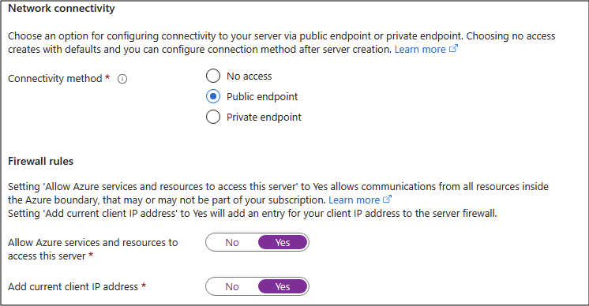
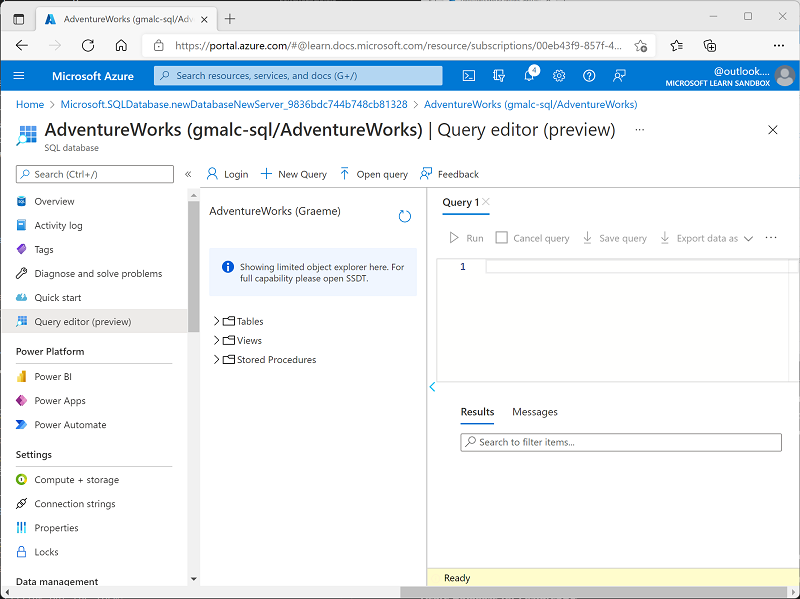

---
lab:
  title: "Изучение Базы данных\_SQL Azure"
  module: Explore relational data in Azure
---

# Изучение Базы данных SQL Azure

В этой лаборатории вы узнаете, как подготовить База данных SQL Azure и взаимодействовать с ним с помощью запросов SQL. Вы будете использовать пример базы данных Microsoft AdventureWorks, которая предоставляет предварительно заполненные таблицы и данные, чтобы сосредоточиться на изучении и запросе реляционных данных без необходимости создавать собственные схемы или вставлять примеры записей. Этот подход упрощает работу и позволяет сосредоточиться на понимании основных понятий базы данных и синтаксисе SQL.

Выполнение этого задания займет около **15** минут.

## Перед началом работы

Вам потребуется [подписка Azure](https://azure.microsoft.com/free) с доступом уровня администратора.

## Подготовка ресурса "База данных SQL Azure"

1. [В портал Azure](https://portal.azure.com?azure-portal=true) выберите **&65291; Создайте ресурс** в левом верхнем углу и выполните поиск`Azure SQL`. Затем на странице **Azure SQL** выберите **Создать**.

    

1. Просмотрите доступные параметры Azure SQL, а затем в области **Базы данных SQL** убедитесь, что выбран пункт **Отдельная база данных**, и нажмите **Создать**.

    

    > _**Совет**. Одна база данных является самой простой и быстрой для настройки для этой лаборатории. Другие параметры еще не нужны._

1. Введите следующие значения на странице **Создание Базы данных SQL** и оставьте для всех остальных свойств значения по умолчанию.
    - **Подписка**. Выберите подписку Azure.
    - **Группа ресурсов**: создайте группу ресурсов с именем по своему выбору.
    - **Имя** базы данных: `AdventureWorks`
    - **Сервер**: выберите **Создать новый** и создайте сервер с уникальным именем в любом доступном расположении. Используйте **проверку подлинности SQL** и укажите имя для входа администратора сервера и достаточно сложный пароль (запомните пароль, он понадобится позже).
    - **Нужно ли использовать эластичный пул SQL?**: *Нет*
    - **Среда рабочих нагрузок**: разработка
    - **Вычисления + хранилище**: оставьте без изменений
    - **Избыточность хранилища резервных копий**: выберите *локально избыточное хранилище резервных копий*.

    > _**Совет.** Проверка подлинности SQL быстро настроена для последней (без дополнительных шагов идентификатора Microsoft Entra). По умолчанию разработка является более дешевой и быстрой. Локальная резервная копия — это простой выбор и штраф для временной базы данных практики._

1. На странице **Создать базу данных SQL** выберите **Далее: Сеть >** и на странице **Сеть** в разделе **Сетевое подключение** выберите **Общедоступная конечная точка**. Затем в разделе **Правила брандмауэра** выберите **Да** для обоих параметров, чтобы разрешить доступ к серверу базы данных из служб Azure и текущего IP-адреса клиента.

    

    > _**Совет**. Общедоступная конечная точка + разрешение IP-адреса позволяет подключаться сразу. Хорошо для короткой лаборатории. В реальных проектах вы обычно блокируете доступ больше._

1. Нажмите **Далее: Безопасность >** и выберите для параметра **Включить Microsoft Defender для SQL** значение **Не сейчас**.

    > _**Совет**. Defender — это платная надстройка безопасности. Мы пропустим его здесь, чтобы держать вещи простыми и избегать затрат в коротком упражнении._

1. Нажмите **Далее: Дополнительные параметры >** и на вкладке **Дополнительные параметры** задайте для параметра **Использовать существующие данные** значение **Пример** (будет создан образец базы данных, который можно изучить позже).

    > _**Совет.** Пример данных предоставляет готовые таблицы и строки, чтобы начать запрос сразу._

1. Щелкните **Просмотр и создание**, а затем нажмите кнопку **Создать**, чтобы создать базу данных SQL Azure.

1. Дождитесь завершения развертывания. Затем перейдите к развернутому ресурсу, который должен выглядеть следующим образом:

    

1. В области в левой части страницы выберите **Редактор запросов (предварительная версия)**, а затем войдите с именем и паролем администратора, указанными вами для вашего сервера.
    
    >**Примечание.** Если сообщение об ошибке, указывающее, что IP-адрес клиента не разрешен, выберите **ссылку Allowlist IP** ... в конце сообщения, чтобы разрешить доступ и попытаться войти снова (вы ранее добавили IP-адрес клиента собственного компьютера в правила брандмауэра, но редактор запросов может подключаться из другого адреса в зависимости от конфигурации сети).
    
    Редактор запросов выглядит следующим образом:
    
    

1. Разверните папку **Таблицы**, чтобы просмотреть таблицы в базе данных.

1. В области **Query 1** введите следующий код SQL:

    ```sql
   SELECT * FROM SalesLT.Product;
    ```

    > _**Совет**. SELECT * быстро отображает каждый столбец и некоторые значения. (В реальных приложениях вы обычно избегаете этого и выбираете только нужные столбцы.)_

1. Нажмите кнопку **&#9655; Запуск** над запросом, чтобы выполнить его и просмотреть результаты, которые должны включать все столбцы для всех строк в таблице **SalesLT.Product**, как показано здесь:

    

1. Замените инструкцию SELECT следующим кодом, а затем нажмите **&#9655; Запуск**, чтобы выполнить новый запрос и просмотреть результаты (которые включают только столбцы **ProductID**, **Name**, **ListPrice** и **ProductCategoryID**):

    ```sql
   SELECT ProductID, Name, ListPrice, ProductCategoryID
   FROM SalesLT.Product;
    ```

    > _**Совет.** Перечисление только необходимых столбцов сокращает результаты и может выполняться быстрее._

1. Теперь попробуйте выполнить следующий запрос, который использует соединение для получения имени категории из таблицы **SalesLT.ProductCategory**:

    ```sql
    SELECT 
        p.ProductID, 
        p.Name AS ProductName,
        c.Name AS Category, 
        p.ListPrice
    FROM SalesLT.Product AS p
    INNER JOIN SalesLT.ProductCategory AS c 
        ON p.ProductCategoryID = c.ProductCategoryID;
    ```

    > _**Совет.** В разделе JOIN показано, как извлечь связанные данные (имя категории) из другой таблицы с помощью соответствующего идентификатора._

1. Закройте панель редактора запросов, отменяя внесенные изменения.

> _**Совет.** Если вы закончили изучение База данных SQL Azure, можно удалить группу ресурсов, созданную в этом упражнении. При удалении группы ресурсов все ресурсы удаляются на одном шаге. Она также сводит к минимуму затраты._
