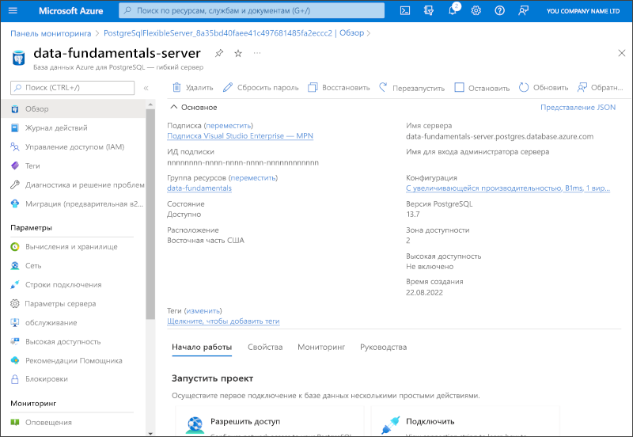

---
lab:
  title: Изучение Базы данных Azure для PostgreSQL
  module: Explore relational data in Azure
---

# Изучение Базы данных Azure для PostgreSQL

В этом упражнении вы подготовите к работе ресурс "База данных Azure для PostgreSQL" в своей подписке Azure.

Выполнение этого задания займет около **5** минут.

## Перед началом работы

Вам потребуется [подписка Azure](https://azure.microsoft.com/free) с доступом уровня администратора.

## Подготовка к работе ресурса "База данных Azure для PostgreSQL"

В этом упражнении вы будете подготавливать к работе ресурс "База данных Azure для PostgreSQL".

1. На портале Azure нажмите **&#65291; Создать ресурс** в верхнем левом углу и найдите *Базу данных Azure для PostgreSQL*. Затем на открывшейся странице **База данных Azure для PostgreSQL** нажмите **Создать**.

1. Просмотрите доступные варианты Базы данных Azure для PostgreSQL и выберите **Гибкий сервер (рекомендуется)** в области **База данных Azure для PostgreSQL**, после чего нажмите **Создать**.

    

1. На странице **Создание Базы данных SQL** введите следующие значения.
    - **Подписка**. Выберите подписку Azure.
    - **Группа ресурсов**: создайте группу ресурсов с именем по своему выбору.
    - **Имя сервера**: введите уникальное имя
    - **Регион**: выберите регион рядом с вами.
    - **Версия PostgreSQL**: оставьте без изменений.
    - **Тип рабочей нагрузки**: выберите **Разработка**.
    - **Вычисления и хранилище**: оставьте без изменений.
    - **Зона доступности**: оставьте без изменений.
    - **Включить высокий уровень доступности**: оставьте без изменений.
    - **Имя администратора**: введите свое имя.
    - **Пароль** и **Подтверждение пароля**: укажите достаточно сложный пароль.

1. Выберите **Далее: сеть**.

1. В разделе **Правила брандмауэра** выберите **&#65291; Добавьте текущий IP-адрес клиента**.

1. Щелкните **Просмотр и создание**, а затем нажмите кнопку **Создать**, чтобы создать базу данных PostgreSQL Azure.

1. Дождитесь завершения развертывания. Затем перейдите к развернутому ресурсу, который должен выглядеть следующим образом:

    

1. Просмотрите варианты управления ресурсом Базы данных Azure для PostgreSQL.

> **Совет.** После завершения изучения Базы данных Azure для PostgreSQL созданную в этом упражнении группу ресурсов можно удалить.
