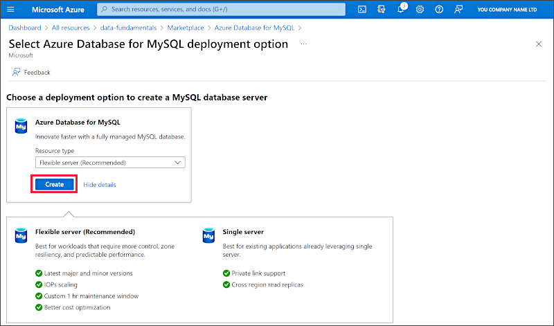

---
lab:
  title: "Изучение Базы данных Azure для\_MySQL"
  module: Explore relational data in Azure
---

# Изучение Базы данных Azure для MySQL

В этом упражнении вы подготовите к работе ресурс "База данных Azure для MySQL" в своей подписке Azure.

Выполнение этого задания займет около **5** минут.

## Перед началом работы

Вам потребуется [подписка Azure](https://azure.microsoft.com/free) с доступом уровня администратора.

## Подготовка к работе ресурса "База данных Azure для MySQL"

В этом упражнении вы будете подготавливать к работе ресурс "База данных Azure для MySQL".

1. In the Azure portal, select <bpt id="p1">**</bpt>&amp;#65291; Create a resource<ept id="p1">**</ept> from the upper left-hand corner and search for <bpt id="p2">*</bpt>Azure Database for MySQL<ept id="p2">*</ept>. Then in the resulting <bpt id="p1">**</bpt>Azure Database for MySQL<ept id="p1">**</ept> page, select <bpt id="p2">**</bpt>Create<ept id="p2">**</ept>.

1. Review the Azure Database for MySQL options that are available. Then for <bpt id="p1">**</bpt>Resource type<ept id="p1">**</ept>, select <bpt id="p2">**</bpt>Flexible Server<ept id="p2">**</ept> and select <bpt id="p3">**</bpt>Create<ept id="p3">**</ept>.

    

1. На странице **Создание Базы данных SQL** введите следующие значения.
    - **Подписка**: Выберите подписку Azure.
    - **Группа ресурсов**: создайте новую группу ресурсов с именем по своему выбору.
    - **Имя сервера**: введите уникальное имя.
    - **Регион**: выберите любое доступное расположение рядом с вами.
    - **Версия MySQL**: оставьте без изменений.
    - **Тип рабочей нагрузки**: для проектов разработки или хобби.
    - **Вычисления и хранилище**: оставьте без изменений.
    - **Зона доступности**: оставьте без изменений.
    - **Включить высокий уровень доступности**: оставьте без изменений.
    - **Имя пользователя администратора**: ваше имя
    - **Пароль** и **Подтверждение пароля**: укажите достаточно сложный пароль

1. По завершении выберите **Next: сеть**.

1. В разделе **Правила брандмауэра** выберите **&#65291; Добавьте текущий IP-адрес клиента**.

1. Щелкните **Просмотр и создание**, а затем нажмите кнопку **Создать**, чтобы создать базу данных MySQL Azure.

1. Wait for deployment to complete. Then go to the resource that was deployed, which should look like this:

    

1. Ознакомьтесь с вариантами управления вашим ресурсом "База данных Azure для MySQL".

> **Совет**. Когда вы завершите знакомство с Базой данных Azure для MySQL, созданную в этом упражнении группу ресурсов можно удалить.
