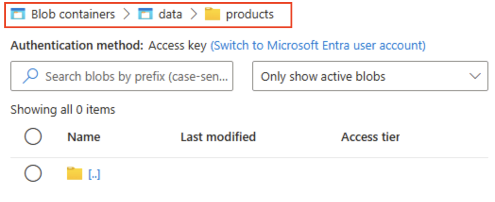

---
lab:
  title: "Знакомство со службой хранилища\_Azure"
  module: Explore Azure Storage for non-relational data
---

# Знакомство со службой хранилища Azure

В этом упражнении вы узнаете, как подготовить и настроить учетную запись служба хранилища Azure, а также изучите основные службы: хранилище BLOB-объектов, Data Lake Storage 2-го поколения, Файлы Azure и таблицы Azure. Вы получите практический опыт создания контейнеров, отправки данных, включения иерархических пространств имен, настройки общих папок и управления сущностями таблиц. Эти навыки помогут вам понять, как хранить, упорядочивать и защищать нереляционные данные в Azure для различных сценариев аналитики и приложений.

Выполнение этого задания займет около **15** минут.

> _**Совет.** Понимание цели каждого действия поможет вам позже разработать решения для хранения, которые балансирует затраты, производительность, безопасность и аналитику. Эти краткие заметки о том, почему каждый шаг привязан к реальной причине._

## Перед началом работы

Вам потребуется [подписка Azure](https://azure.microsoft.com/free) с доступом уровня администратора.

## Подготовка учетной записи службы хранилища Azure

Первый шаг при использовании службы хранилища Azure — подготовка учетной записи службы хранилища Azure в подписке Azure.

> _**Совет.** Учетная запись хранения — это безопасная, оплачиваемая граница для всех служб служба хранилища Azure (большие двоичные объекты, файлы, очереди, таблицы). Политики, избыточность, шифрование, сеть и управление доступом применяются отсюда вниз._

1. Если вы еще этого не сделали, войдите на [портал Azure](https://portal.azure.com?azure-portal=true).

1. На домашней странице портал Azure выберите **&65291; Создайте ресурс** в левом верхнем углу и выполните поиск`Storage account`. Затем на полученной странице **Службы хранилища учетной записи** выберите **Создать**.

    

1. В мастере **Создание учетной записи хранения** введите приведенные ниже значения:
   
    - **Подписка**. Выберите подписку Azure.
    - **Группа ресурсов**: создайте группу ресурсов с именем по своему выбору.
    - **Служба хранилища имя учетной записи**: введите уникальное имя для учетной записи хранения, используя буквы и цифры в нижнем регистре.
    - **Регион**: выберите любое доступное расположение.
    - **Производительность**: *стандартная*
    - **Избыточность**: *выберите Локально избыточное хранилище (LRS)*

    

    > _**Совет.** Новая группа ресурсов упрощает очистку. Стандарт + LRS — это базовый план с наименьшей стоимостью, хорошо подходит для обучения. LRS сохраняет три синхронные копии в одном регионе, достаточно для некритических демонстрационных данных без оплаты георепликации._

1. Выберите **Далее: Дополнительно >** и просмотрите расширенные параметры конфигурации. В частности, обратите внимание, что в этом случае можно включить иерархическое пространство имен для поддержки Azure Data Lake Storage 2-го поколения. Оставьте этот параметр **<u>снят</u>** (вы включите его позже), а затем нажмите кнопку **"Далее: сеть >** " для просмотра параметров сети для учетной записи хранения.
   
   

1. Выберите **Далее: Защита данных >**, а затем в разделе **Восстановление** <u>снимите</u> все флажки **Включить обратимое удаление…**. Эти параметры позволяют хранить удаленные файлы для последующего восстановления, но могут вызвать проблемы позже при включении иерархического пространства имен.

    

1. Листайте оставшиеся страницы, нажимая **Далее >** и не меняя параметры по умолчанию, а затем на странице **Проверка** дождитесь подтверждения своих настроек и выберите **Создать**. Ваша учетная запись хранения Azure будет создана.

1. Дождитесь завершения развертывания. Затем перейдите к развернутому ресурсу.

## Исследуйте хранилище BLOB-объектов

Теперь, когда у вас есть учетная запись службы хранилища Azure, можно создать контейнер для данных BLOB-объектов.

> _**Совет.** Большие двоичные объекты групп контейнеров и первый уровень области для управления доступом. Начиная с обычного хранилища BLOB-объектов (без иерархического пространства имен) отображается поведение виртуальной папки, по сравнению с Data Lake 2-го поколения позже._

1. Скачайте JSON-файл [product1.json](https://aka.ms/product1.json?azure-portal=true) из `https://aka.ms/product1.json` и сохраните его на компьютере (его можно сохранить в любой папке — вы сможете отправить его в хранилище BLOB-объектов позже).

    *Если JSON-файл отображается в браузере, щелкните правой кнопкой мыши страницу и нажмите кнопку **"Сохранить как**". Назовите файл  **product1.json** и сохраните его в папке загрузки.* 

2. На странице контейнера хранилища на портале Azure слева в разделе **Хранилище данных** выберите **Контейнеры**.
   
    

3. **На странице "Контейнеры"** выберите **&#65291; Добавьте контейнер** и добавьте новый контейнер `data` с анонимным уровнем доступа частного (без анонимного **доступа).**

    

    > _**Совет.** Приватный обеспечивает безопасность примеров данных. Общедоступный доступ редко требуется, за исключением статических веб-сайтов или сценариев открытых данных. Именование сохраняет `data` этот пример простым и читаемым._

4. После создания контейнера **data** убедитесь, что он указан на странице **Контейнеры**.

5. В верхней части области слева выберите **Обозреватель хранилища**. На этой странице представлен интерфейс на основе браузера, который можно использовать для работы с данными в вашей учетной записи хранения.

6. На странице обозревателя хранилища выберите **Контейнеры BLOB-объектов** и убедитесь, что контейнер **data** присутствует в списке.

7. Выберите контейнер **data** и обратите внимание, что он пуст.

    

8. Выберите **&65291; Добавьте каталог** и прочитайте сведения о папках перед созданием нового каталога с именем `products`.

9. В обозревателе хранилища убедитесь, что содержимое только что созданной папки **products** отображается в текущем представлении. Вверху страницы должна быть цепочка навигации **Контейнеры BLOB-объектов > data > products**.

    

10. В навигационной цепочка выберите **data** для переключения в контейнер **data** и обратите внимание, что она <u>не</u> содержит папку **Products**.

    Папки в хранилище BLOB-объектов являются виртуальными и существуют только как часть пути к BLOB-объекту. Так как папка **Products** не содержит BLOB-объектов, на самом деле это не так.

    > _**Совет**. Неструктурированное пространство имен означает, что каталоги являются просто префиксами имен (products/file.json). Эта конструкция позволяет масштабироваться, так как имена БОЛЬШИХ двоичных объектов индексов служб вместо поддержания истинной структуры дерева._

11. Нажмите кнопку **&#10514; Отправить**, чтобы открыть панель **Отправить BLOB-объект**.

12. На панели **Загрузка BLOB-объектов** выберите файл **product1.json**, сохраненный на локальном компьютере ранее. Затем в разделе "Дополнительно" в **поле "Отправить в папку **" введите **`product_data` и нажмите кнопку **"Отправить**".**

    

    > _**Совет.** Указание имени папки при отправке автоматически создает виртуальный путь, иллюстрируя наличие большого двоичного объекта, отображается "папка"._

13. Закройте панель **Загрузка BLOB-объектов**, если она еще открыта, и убедитесь, что в контейнере **data** создана **product_data** виртуальная папка.

14. Выберите папку **product_data** и убедитесь, что она содержит отправленный BLOB-объект **product1.json**.

15. В левой части в разделе **Хранилище данных** выберите **Контейнеры**.

16. Откройте контейнер **data** и убедитесь, что в списке указана созданная папка **product_data**.

17. **Выберите &#x2027; &#x2027; &#x2027;** значок в правой части папки и обратите внимание, что меню не отображает никаких параметров. Папки в контейнере BLOB-объектов с неструктурированным пространством имен являются виртуальными, и управлять ими невозможно.

    

    > _**Совет.** Нет реального объекта каталога, поэтому для них не требуется иерархическое пространство имен._

18. Используйте значок **X** в правом верхнем углу страницы **data**, чтобы закрыть страницу и вернуться на страницу **Контейнеры**.

## Знакомство с Azure Data Lake Storage 2-го поколения

Поддержка Azure Data Lake Store Gen2 позволяет использовать иерархические папки для организации и управления доступом к BLOB-объектам. Она также позволяет использовать хранилище BLOB-объектов Azure для размещения распределенных файловых систем с общими платформами для аналитики больших данных.

> _**Совет.** Включение иерархического пространства имен позволяет папкам вести себя как реальные каталоги. Он также позволяет безопасно выполнять действия папок (все одновременно без ошибок) и предоставляет элементы управления разрешениями на файлы, аналогичные элементам управления в Linux. Это особенно полезно при работе с инструментами больших данных, такими как Spark или Hadoop, или при управлении большими, упорядоченными озерами данных._

1. [Скачайте product2.json JSON-файл `https://aka.ms/product2.json` из и сохраните его на компьютере в той же папке, в которой вы скачали **product1.json](https://aka.ms/product2.json?azure-portal=true)** ранее, вы отправите его в хранилище BLOB-объектов позже.

1. С левой стороны страницы портала Azure для учетной записи хранения прокрутите экран вниз до раздела **Параметры** и выберите **Обновление Data Lake 2-го поколения**.

    

1. **На странице обновления** Data Lake 2-го поколения разверните и выполните каждый шаг, чтобы обновить учетную запись хранения, чтобы включить иерархическое пространство имен и поддержку Azure Data Lake Storage Gen. Это может занять некоторое время.

    

    > _**Совет.** Обновление — это переключатель возможностей на уровне учетной записи— данные остаются, но семантика каталога изменяется для поддержки расширенных операций._

1. После завершения обновления в верхней части области слева выберите **Обозреватель хранилища** и вернитесь к корню контейнера BLOB-объектов **data**, который по-прежнему содержит папку **product_data**.

1. Выберите папку **product_data** и убедитесь, что она все еще содержит файл **product1.json**, который вы ранее перегрузили.

1. Нажмите кнопку **&#10514; Отправить**, чтобы открыть панель **Отправить BLOB-объект**.

1. На панели **Загрузка BLOB-объектов** выберите файл **product2.json**, сохраненный на локальном компьютере. Затем нажмите кнопку **Отправить**.

1. Закройте панель **Загрузка BLOB-объектов**, если она еще открыта, и убедитесь, что в папке **product_data** теперь есть файл **product2.json**.

    

    > _**Совет.** Добавление второго файла после обновления подтверждает непрерывную непрерывность: существующие большие двоичные объекты по-прежнему работают, а новые получают иерархические преимущества, такие как списки управления доступом к каталогу (контроль доступа списки)._

1. В левой части в разделе **Хранилище данных** выберите **Контейнеры**.

1. Откройте контейнер **data** и убедитесь, что в списке указана созданная папка **product_data**.

1. Щелкните значок **&#x2027;&#x2027;&#x2027;** с правого края папки и обратите внимание, что при включенном иерархическом пространстве имен можно выполнять задачи настройки на уровне папки, в том числе переименование папок и задание разрешений.

    

    > _**Совет.** Реальные папки позволяют применять минимальные привилегии безопасности при детализации папок, переименовывать безопасно и быстро рекурсивные списки и сканировать тысячи префиксированных имен больших двоичных объектов._

1. Используйте значок **X** в правом верхнем углу страницы **data**, чтобы закрыть страницу и вернуться на страницу **Контейнеры**.

## Обзор Файлов Azure

Служба Файлов Azure предоставляет способ создания облачных файловых ресурсов.

> _**Совет.** Файлы Azure предлагает конечные точки SMB/NFS для сценариев лифта и смены, в которых приложения ожидают традиционную файловую систему. Он дополняет (не заменяет) хранилище BLOB-объектов, поддерживая блокировки файлов и средства на основе ОС._

1. На странице контейнера хранилища на портале Azure слева в разделе **Хранилище данных** выберите **Контейнеры**.

    

1. На странице общих папок выберите **&65291; ** Общая папка и добавление новой общей папки с именем `files` с помощью оптимизированного** для транзакций **уровня.

1. Нажмите кнопку **"Далее": >** резервного копирования и отключите резервное копирование. Щелкните **Просмотр и создание**.

    

    > _**Совет.** Отключение резервного копирования экономит затраты на кратковременную лабораторной среде. Это позволит обеспечить устойчивость рабочей среды._

1. В **общих файловых ресурсах** откройте **общую папку**.

1. В верхней части страницы выберите **Подключение**. Затем в области **Подключение** обратите внимание на наличие вкладок для общих операционных систем (Windows, Linux и macOS), содержащих скрипты, которые можно выполнять для подключения к общей папке с клиентского компьютера.

    

    > _**Совет.** Созданные скрипты показывают, как подключить общую папку с помощью собственных команд платформы, иллюстрируя шаблоны гибридного доступа с виртуальных машин, контейнеров или локальных серверов._

1. Закройте панель **Подключение**, а затем закройте страницу **files**, чтобы вернуться на страницу **Общих файловых ресурсов** для вашей учетной записи хранения Azure.

## Знакомство с Таблицами Azure

Таблицы Azure предоставляют хранилище "ключ/значение" для приложений, которые должны хранить значения данных, но не нуждаются в полной функциональности и структуре реляционной базы данных.

> _**Совет.** Хранилище таблиц торгует богатыми запросами и соединениями для ультра-низкой стоимости, гибкости без схемы и горизонтального масштабирования — идеально подходит для журналов, данных Интернета вещей или профилей пользователей._

1. На странице контейнера хранилища на портале Azure слева в разделе **Хранилище данных** выберите **Таблицы**.

    

1. **На странице "Таблицы**" выберите **&#65291; Таблица** и создание новой таблицы с именем`products`.

1. После создания таблицы **products** в верхней части области слева выберите **Обозреватель хранилища**.

1. В обозревателе хранилища выберите **Таблицы** и убедитесь, что таблица **products** указана в списке.

1. Выберите таблицу **products**.

1. На странице **products** выберите **&#65291; Добавление сущности**.

1. На панели **Добавить сущность** введите следующие значения ключей:
    - **PartitionKey**: 1
    - **RowKey**: 1

    > _**Совет.** Секционирование групп, связанных с сущностями для распределения нагрузки; RowKey однозначно идентифицирует в разделе. Вместе они образуют быстрый составной первичный ключ для поиска._

1. Выберите " **Добавить свойство**" и создайте два новых правильных значения со следующими значениями:

    |Имя свойства | Тип | значение |
    | ------------ | ---- | ----- |
    | Имя. | Строка | Мини-приложение |
    | Цена, | Двойной | 2,99 |

    

1. Нажмите кнопку **Вставить**, чтобы вставить строку для новой сущности в таблицу.

1. В обозревателе хранилища убедитесь, что строка была добавлена в таблицу **Products** и что был создан столбец **timestamp** для указания времени последнего изменения строки.

1. Добавьте еще одну сущность в таблицу **Products** со следующими свойствами:

    |Имя свойства | Тип | значение |
    | ------------ | ---- | ----- |
    | PartitionKey | Строка | 1 |
    | RowKey | Строка | 2 |
    | Имя. | Строка | Kniknak |
    | Цена, | Двойной | 1,99 |
    | Выведено из использования | Логический | true |

    > _**Совет.** Добавление второй сущности с разными ключами и дополнительным логическим свойством демонстрирует гибкость записи схемы — новые атрибуты не требуют миграции._

1. После вставки новой сущности убедитесь, что в таблице показана строка, содержащая неподдерживаемый продукт.

    Вы вручную указали данные в таблице с помощью интерфейса браузера хранилища. В реальной ситуации разработчики приложений могут использовать API службы хранилища таблиц Azure для создания приложений, считывающих и записывающих значения в таблицы, что делает его экономичным и масштабируемым решением для хранилища NoSQL.

> _**Совет.** Если вы закончили изучение служба хранилища Azure, вы можете удалить группу ресурсов, созданную в этом упражнении. Удаление группы ресурсов является самым быстрым способом, чтобы избежать текущих расходов, удалив каждый ресурс, созданный в одном действии._
