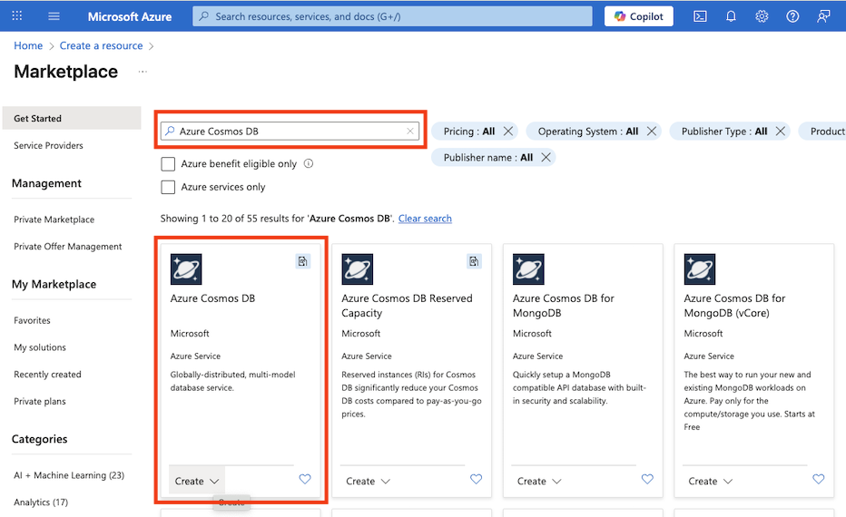

---
lab:
  title: "Знакомство с возможностями Azure Cosmos\_DB"
  module: Explore fundamentals of Azure Cosmos DB
---
# Знакомство с возможностями Azure Cosmos DB

Завершив эту лабораторию, вы узнаете, как подготовить учетную запись Azure Cosmos DB, создать пример базы данных и контейнер, добавить и просмотреть элементы JSON, а также запустить запросы, такие как SQL, для получения данных. Вы получите практический опыт работы с портал Azure и понять, как Cosmos DB поддерживает гибкое, нереляционное хранилище данных и запросы.

Выполнение этого задания займет около **15** минут.

## Перед началом работы

Вам потребуется [подписка Azure](https://azure.microsoft.com/free) с доступом уровня администратора.

## Создание учетной записи Cosmos DB

Чтобы использовать Cosmos DB, необходимо подготовить учетную запись Cosmos DB в подписке Azure. В этом упражнении вы подготовите учетную запись Cosmos DB, которая использует Azure Cosmos DB for NoSQL.

1. В портал Azure выберите **+Создать ресурс** в левом верхнем углу и выполните поиск`Azure Cosmos DB`.  Выберите **Azure Cosmos DB** в результатах и нажмите **Создать**.

    

1. На плитке **Azure Cosmos DB for NoSQL** выберите элемент **Создать**.

    
   
    > _**Совет.** Учетная запись — это верхний уровень ресурсов Cosmos DB. Выбор Azure Cosmos DB для NoSQL позволяет хранить и запрашивать данные JSON с помощью простого языка запросов, например SQL._

1. Введите приведенные ниже сведения и нажмите кнопку **Проверка и создание**.
   
    - **Тип** рабочей нагрузки: обучение
    - **Подписка**: если вы используете песочницу, выберите пункт *Concierge Subscription*. В противном случае выберите свою подписку Azure.
    - **Группа ресурсов**: если вы используете песочницу, выберите существующую группу ресурсов (с именем вида *learn-xxxx…*). В противном случае создайте новую группу с именем по вашему выбору.
    - **Имя учетной записи**: введите уникальное имя.
    - **** Зоны доступности. Отключение
    - **Location**: выберите любое из рекомендованных расположений
    - **Режим производительности**: подготовленная пропускная способность
    - **Применить скидку бесплатной категории**: выберите "Применить", если доступно
    - **Ограничение общей пропускной способности учетной записи**: не выбрано
  
    > _**Почему эти варианты?**_
    >
    > _Мы устанавливаем **тип** рабочей нагрузки для обучения, так как он поставляется с понятными для начинающих значениями по умолчанию, что упрощает настройку и позволяет снизить затраты. Имя** учетной **записи должно быть уникальным для всей службы, так как она становится частью URL-адреса службы. Мы выбрали **расположение**, близкое к вам, чтобы тесты выполнялись быстрее; какие расположения будут зависеть от вашей подписки и от того, включены ли определенные зоны доступности. Для **режима** емкости мы собираемся с подготовленной пропускной способностью, чтобы производительность оставалась предсказуемой во время этой короткой лаборатории, хотя бессерверные могут быть хорошо, если требуется только иногда. Если уровень "Бесплатный****" доступен, мы будем использовать его так, чтобы вы могли экспериментировать без сбора расходов. Наконец, мы сохраняем параметр "**ограничение общей пропускной способности учетной записи**", чтобы ничего не замедлялось неожиданно во время работы._

1. После проверки конфигурации выберите **Создать**.

    > _**Совет.** Портал Azure оценивает, сколько времени потребуется для подготовки этого экземпляра CosmosDB. Предполагаемое время создания вычисляется на основе выбранного расположения._

1. Дождитесь завершения развертывания. Затем перейдите к развернутому ресурсу.

## Создание образца базы данных

*На протяжении всей процедуры закрывайте любые советы, отображаемые на портале*.

1. На странице новой учетной записи Cosmos DB выберите на панели слева **Обозреватель данных**.

    

1. На странице **Обозреватель данных** щелкните **Launch quick start** (Запустить быстрый запуск).

    > _**Совет.** Краткое руководство по созданию рабочей базы данных, контейнера и примера данных, чтобы сначала можно было добавлять и запрашивать элементы без разработки схемы._

1. На вкладке **Создать контейнер** просмотрите предварительно заполненные параметры для примера базы данных и щелкните **ОК**.

1. Отслеживайте состояние на панели в нижней части экрана, пока не будет создана база данных **SampleDB** и контейнер **SampleContainer** (это может занять около минуты).

## Просмотр и создание элементов

1. На странице обозревателя данных разверните базу данных **SampleDB** и контейнер **SampleContainer**, а затем выберите **Элементы**, чтобы просмотреть список элементов в этом контейнере. Элементы представляют данные о продукте, каждый из которых имеет уникальный идентификатор и другие свойства.

    

1. Выберите любой из элементов в списке, чтобы просмотреть представление JSON данных элемента.

1. В верхней части страницы выберите **Создать элемент**, чтобы создать новый пустой элемент.

1. Измените JSON для нового элемента, как показано ниже, а затем нажмите кнопку **Сохранить**.

    ```json
   {
       "name": "Road Helmet,45",
       "id": "123456789",
       "categoryID": "123456789",
       "SKU": "AB-1234-56",
       "description": "The product called \"Road Helmet,45\" ",
       "price": 48.74
   }
    ```

    

1. После сохранения нового элемента обратите внимание, что дополнительные свойства метаданных добавляются автоматически.

    > _**Совет**. Cosmos DB сохраняет элементы в формате JSON (нотация объектов JavaScript), чтобы добавить поля, соответствующие вашему сценарию без жесткой схемы. Он `id` должен быть уникальным в контейнере. После сохранения Cosmos DB добавляет системные свойства (например, метки времени и внутренние идентификаторы) для управления и оптимизации данных:_
    > - *_rid — внутренний идентификатор ресурса, используемый Cosmos DB для внутреннего определения элемента.*
    > - *_self — полная ссылка на ресурс для элемента.*
    > - *_etag — тег сущности, используемый для проверки оптимистического параллелизма.*
    > - *_ts — метка времени Unix (в секундах) при последнем изменении элемента.*
    > - *_attachments — ссылка на вложения документа (если таковые есть).*

## Запрос к базе данных

1. На странице **Обозреватель данных** щелкните значок **Новый запрос SQL**.

    

1. В редакторе запросов SQL проверьте запрос по умолчанию (`SELECT * FROM c`) и нажмите кнопку **Выполнить запрос**.

1. Проверьте результаты, включая полное представление JSON всех элементов.

1. Измените запрос следующим образом:

    ```sql
   SELECT *
   FROM c
   WHERE CONTAINS(c.name,"Helmet")
    ```

    > _**Совет.** API NoSQL использует знакомые запросы SQL для поиска документов JSON. `SELECT * FROM c` Перечисляет все элементы и `CONTAINS` фильтры по тексту в свойстве, полезные для быстрого поиска без дополнительной настройки._

1. Нажмите кнопку **Выполнить запрос**, чтобы выполнить измененный запрос и просмотреть его результаты, в том числе сущности JSON для всех элементов, у которых поле **bимя** содержит строку текста "Helmet".

    

1. Закройте редактор запросов SQL, отменив изменения.

    Вы узнали, как создавать и запрашивать сущности JSON в базе данных Cosmos DB с помощью интерфейса обозревателя данных на портале Azure. В реальной ситуации разработчик приложения использовал бы один из множества пакетов разработки программного обеспечения (пакет SDK) для конкретного языка программирования, чтобы вызвать API NoSQL и работать с данными в базе данных.

> _**Совет.** Если вы закончили изучение Azure Cosmos DB, вы можете удалить группу ресурсов, созданную в этом упражнении._
