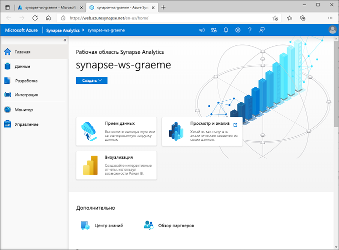
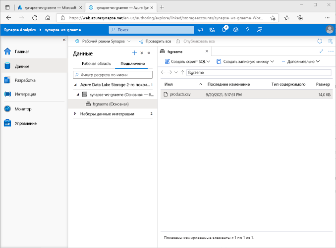
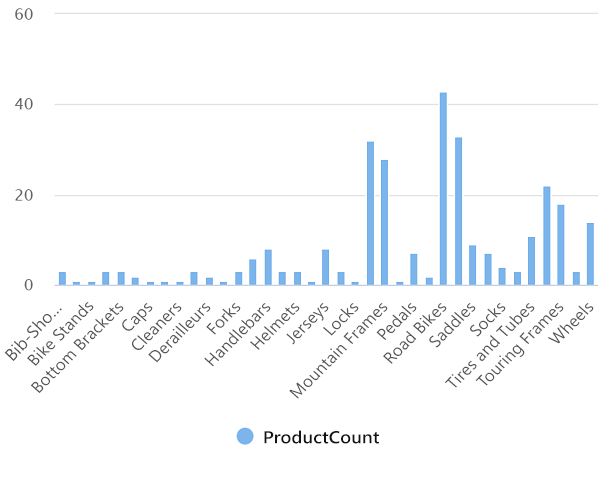
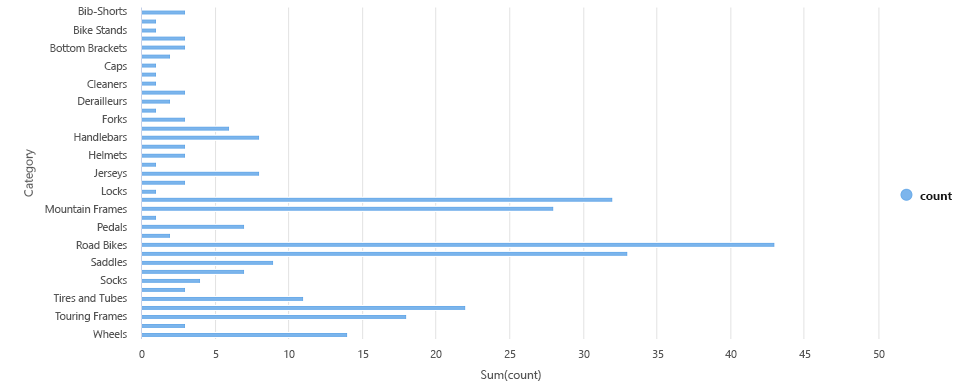

---
lab:
  title: "Изучение аналитики данных в Azure с помощью Azure Synapse\_Analytics"
  module: Explore fundamentals of large-scale data warehousing
---

# <a name="explore-data-analytics-in-azure-with-azure-synapse-analytics"></a>Изучение аналитики данных в Azure с помощью Azure Synapse Analytics

В этом упражнении вы подготовите к работе рабочую область Azure Synapse Analytics в своей подписке Azure и будете использовать ее для приема и запроса данных.

Выполнение этого задания займет около **30** минут.

## <a name="before-you-start"></a>Перед началом работы

Вам потребуется [подписка Azure](https://azure.microsoft.com/free) с доступом уровня администратора.

## <a name="provision-an-azure-synapse-analytics-workspace"></a>Подготовьте рабочую область Azure Synapse Analytics

Чтобы использовать Azure Synapse Analytics, необходимо подготовить ресурс рабочей области Azure Synapse Analytics в подписке Azure.

1. Войдите на портал Azure по адресу [https://portal.azure.com](https://portal.azure.com?azure-portal=true), используя учетные данные, связанные с вашей подпиской Azure.

    >                 **Совет**. Убедитесь, что работаете в каталоге, содержащем вашу подписку. Он указан в правом верхнем углу под идентификатором пользователя. В противном случае нажмите значок пользователя и переключите каталог.

2. На портале Azure на **домашней** странице используйте значок **&#65291; Создать ресурс**, чтобы создать новый ресурс.
3. Выполните поиск по запросу *Azure Synapse Analytics* и создайте хранилище **Azure Synapse Analytics** с приведенными ниже параметрами.
    - **Подписка**. *Ваша подписка Azure*
        - **Группа ресурсов** — *создайте новую группу ресурсов с подходящим именем, например "synapse-rg".*
        - **Управляемая группа ресурсов** — *введите подходящее имя, например "synapse-managed-rg".*
    - **Имя рабочей области** — *введите уникальное имя рабочей области, например "synapse-ws-<ваше_имя>"* .
    - **Регион**: *выберите любой из следующих регионов*:
        - Восточная Австралия
        - Центральная часть США
        - восточная часть США 2
        - Северная Европа
        - Центрально-южная часть США
        - Юго-Восточная Азия
        - южная часть Соединенного Королевства
        - Западная Европа
        - западная часть США
        - WestUS 2
    - **Выбор Data Lake Storage 2-го поколения** — из подписки.
        - **Имя учетной записи** — *создайте новую учетную запись с уникальным именем, например "datalake<vashe_imya>".*
        - **Имя файловой системы** — *создайте новую файловую систему с уникальным именем, например "fs<vashe_imya>".*

    >                 **Примечание**. Для рабочей области Synapse Analytics требуются две группы ресурсов в подписке Azure: одна для ресурсов, явно создаваемых вами, а другая — для управляемых ресурсов, используемых службой. Для нее также необходима учетная запись хранения Data Lake, в которой она будет хранить данные, скрипты и другие артефакты.

4. После ввода этих сведений выберите **Просмотр и создание**, а затем выберите **Создать**, чтобы создать рабочую область.
5. Дождитесь создания рабочей области. Это займет около пяти минут.
6. После завершения развертывания перейдите к созданной группе ресурсов и обратите внимание, что она содержит рабочую область Synapse Analytics и учетную запись хранения Data Lake.
7. Выберите рабочую область Synapse и на странице **Обзор** в карточке **Открыть Synapse Studio** выберите **Открыть**, чтобы открыть Synapse Studio на новой вкладке браузера. Synapse Studio — это веб-интерфейс, с помощью которого можно использовать рабочую область Synapse Analytics.
8. В левой части Synapse Studio используйте значок **&rsaquo;&rsaquo;**, чтобы развернуть меню. Будут показаны различные страницы в Synapse Studio для управления ресурсами и выполнения задач аналитики данных, как показано ниже:

    

## <a name="ingest-data"></a>Прием данных

Одной из основных задач, которые можно выполнить с помощью Azure Synapse Analytics, является определение *конвейеров*, которые передают (и при необходимости преобразуют) данные из широкого диапазона источников в рабочую область для анализа.

1. На **домашней** странице Synapse Studio выберите **Прием**, чтобы открыть средство **Копирование данных**.
2. В средстве "Копирование данных" на шаге **Свойства** убедитесь, что выбран параметр **Встроенная задача копирования** и **Запустить сейчас один раз**, а затем нажмите кнопку **Далее >**.
3. На шаге **Источник** во вложенном шаге **Набор данных** выберите следующие параметры:
    - **Тип источника**: все
    - **Подключение:** *создайте новое подключение и на появившейся панели **Новое подключение** выберите **HTTP** на вкладке **Файл**. Затем нажмите "Продолжить" и создайте подключение к файлу данных со следующими параметрами:*
        - **Имя** — AdventureWorks Products.
        - **Описание** — список продуктов по протоколу HTTP.
        - **Подключить через среду выполнения интеграции** — AutoResolveIntegrationRuntime.
        - **Базовый URL-адрес** — `https://raw.githubusercontent.com/MicrosoftLearning/DP-900T00A-Azure-Data-Fundamentals/master/Azure-Synapse/products.csv`.
        - **Проверка сертификата сервера** — включите.
        - **Тип проверки подлинности** — анонимный.
4. После создания подключения во вложенном шаге **Источник/набор данных** убедитесь, что выбраны следующие параметры, а затем выберите **Далее >**:
    - **Относительный URL-адрес** — *оставьте пустым.*
    - **Метод запроса**: GET
    - **Дополнительные заголовки** — *оставьте пустым.*
    - **Двоичное копирование** — <u>не</u> выбрано.
    - **Время ожидания запроса** — *оставьте пустым.*
    - **Максимальное число одновременных подключений** — *оставьте пустым.*
5. На шаге **источник** во вложенном шаге **Конфигурация** выберите **Предварительный просмотр данных**, чтобы просмотреть данные о продуктах, которые будет принимать конвейер, а затем закройте предварительный просмотр.
6. После предварительного просмотра данных на шаге **Источник/конфигурация** убедитесь, что выбраны следующие параметры, а затем выберите **Далее >**:
    - **Формат файла**: DelimitedText
    - **Разделитель столбцов** — запятая (,).
    - **Разделитель строк** — перевод строки (\n).
    - **Первая строка как заголовок** — выбрано.
    - **Тип сжатия** — нет.
7. На шаге **Цель** во вложенном шаге **Набор данных** выберите следующие параметры:
    - **Тип целевого объекта**: Azure Data Lake Storage 2-го поколения
    - **Подключение**: *выберите существующее подключение к хранилищу озера данных (оно было создано при создании рабочей области).*
8. Выбрав подключение, на шаге **Цель/Набор данных** убедитесь, что выбраны следующие параметры, а затем нажмите **Далее >** :
    - **Путь к папке** — *перейдите к папке файловой системы.*
    - **Имя файла** — products.csv.
    - **Поведение копирования**: нет.
    - **Максимальное число одновременных подключений** — *оставьте пустым.*
    - **Размер блока (МБ)**  — *оставьте пустым.*
9. На шаге **Цель** во вложенном файле **Конфигурация** убедитесь, что выбраны приведенные ниже свойства. Затем выберите **Далее >**:
    - **Формат файла**: DelimitedText
    - **Разделитель столбцов** — запятая (,).
    - **Разделитель строк** — перевод строки (\n).
    - **Добавить заголовок в файл** — выбрано.
    - **Тип сжатия** — нет.
    - **Максимальное число строк на файл** — *оставьте пустым.*
    - **Префикс имени файла** — *оставьте пустым.*
10. На шаге **Настройки** укажите следующие сведения, а затем нажмите кнопку **Далее >**:
    - **Имя задачи** — "Копирование продуктов".
    - **Описание задачи** — "Копирование данных продуктов".
    - **Отказоустойчивость** — *оставьте пустым.*
    - **Включить ведение журнала**: <u>не</u> выбрано.
    - **Включить промежуточное хранение** — <u>не</u> выбрано.
11. На шаге **Проверка и завершение** на вложенном шаге **Проверка** прочтите сводку и нажмите кнопку **Далее >**.
12. На шаге **Развертывание** дождитесь развертывания конвейера и нажмите кнопку **Готово**.
13. Откройте в Synapse Studio страницу **Монитор** и на вкладке **Запуски конвейера** дождитесь завершения конвейера **Копирование продуктов** с состоянием **Выполнено** (чтобы обновить состояние, используйте на странице запусков конвейера кнопку **&#8635; Обновить**).
14. На странице **Данные** выберите вкладку **Связанные** и разворачивайте иерархию **Azure Data Lake Storage 2-го поколения** до тех пор, пока не появится хранилище файлов для рабочей области Synapse. Затем выберите хранилище файлов, чтобы убедиться, что файл с именем **products.csv** скопирован в это расположение, как показано ниже:

    

## <a name="use-a-sql-pool-to-analyze-data"></a>Использование пула SQL для анализа данных

Теперь, когда вы приняли данные в рабочую область, вы можете использовать Synapse Analytics для запросов и анализа. Одним из наиболее распространенных способов для запроса данных является использование SQL. В Synapse Analytics можно использовать *пул SQL* для выполнения кода SQL.

1. В Synapse Studio щелкните правой кнопкой мыши файл **products.csv** в хранилище файлов для рабочей области Synapse, наведите указатель на пункт **Новый скрипт SQL** и выберите **Выбрать первые 100 строк**.
2. В открывшейся области **Сценарий SQL 1** проверьте созданный код SQL, который должен выглядеть примерно так:

    ```SQL
    -- This is auto-generated code
    SELECT
        TOP 100 *
    FROM
        OPENROWSET(
            BULK 'https://datalakexx.dfs.core.windows.net/fsxx/products.csv',
            FORMAT = 'CSV',
            PARSER_VERSION='2.0'
        ) AS [result]
    ```

    Этот код открывает набор строк из импортированного текстового файла и извлекает первые 100 строк данных.

3. Убедитесь, что в списке **Подключение к** выбрано значение **Встроенный** — это встроенный пул SQL, который был создан в рабочей области.
4. На панели инструментов используйте кнопку **&#9655; Выполнить**, чтобы выполнить код SQL, и просмотрите результаты, которые должны выглядеть примерно так:

    | C1 | c2 | c3 | c4 |
    | -- | -- | -- | -- |
    | ProductID | ProductName | Категория | ListPrice |
    | 771 | Mountain-100 Silver, 38 | Горные велосипеды | 3399.9900 |
    | 772 | Mountain-100 Silver, 42 | Горные велосипеды | 3399.9900 |
    | ... | ... | ... | ... |

5. Обратите внимание, что результаты состоят из четырех столбцов с именами C1, C2, C3 и C4, и что первая строка в результатах содержит имена полей данных. Чтобы устранить эту проблему, добавьте в функцию OPENROWSET параметры HEADER_ROW = TRUE, как показано ниже (замените *datalakexx* и *fsxx* на имена учетной записи хранения озера данных и файловой системы), а затем повторно выполните запрос:

    ```SQL
    SELECT
        TOP 100 *
    FROM
        OPENROWSET(
            BULK 'https://datalakexx.dfs.core.windows.net/fsxx/products.csv',
            FORMAT = 'CSV',
            PARSER_VERSION='2.0',
            HEADER_ROW = TRUE
        ) AS [result]
    ```

    Теперь результаты выглядят следующим образом:

    | ProductID | ProductName | Категория | ListPrice |
    | -- | -- | -- | -- |
    | 771 | Mountain-100 Silver, 38 | Горные велосипеды | 3399.9900 |
    | 772 | Mountain-100 Silver, 42 | Горные велосипеды | 3399.9900 |
    | ... | ... | ... | ... |

6. Измените запрос следующим образом (заменив *datalakexx* и *fsxx* именами учетной записи хранения озера данных и файловой системы):

    ```SQL
    SELECT
        Category, COUNT(*) AS ProductCount
    FROM
        OPENROWSET(
            BULK 'https://datalakexx.dfs.core.windows.net/fsxx/products.csv',
            FORMAT = 'CSV',
            PARSER_VERSION='2.0',
            HEADER_ROW = TRUE
        ) AS [result]
    GROUP BY Category;
    ```

7. Выполните измененный запрос, который должен возвращать результирующий набор, содержащий количество продуктов в каждой категории, например:

    | Категория | ProductCount |
    | -- | -- |
    | Велошорты | 3 |
    | Велосипедные стойки | 1 |
    | ... | ... |

8. В области **Свойства** для **Скрипта SQL 1**измените **Имя** на **Подсчет продуктов по категориям**. Затем на панели инструментов выберите **Опубликовать**, чтобы сохранить скрипт.

9. Закройте панель скриптов **Подсчет продуктов по категориям**.

10. В Synapse Studio выберите страницу **Разработка** и обратите внимание, что в ней был сохранен скрипт SQL **Подсчет продуктов по категориям**.

11. Выберите скрипт SQL **Подсчет продуктов по категориям**, чтобы снова открыть его. Затем убедитесь, что скрипт подключен к **встроенному** пулу SQL и запустите его для получения количества продуктов.

12. В области **Результаты** выберите представление **Диаграмма**, а затем выберите следующие параметры диаграммы:
    - **Тип диаграммы** — гистограмма.
    - **Столбец категории** — категория.
    - **Столбцы условных обозначений (рядов)**  — ProductCount.
    - **Расположение условных обозначений** — снизу по центру.
    - **Метка условных обозначений (рядов)**  — *оставьте пустым.*
    - **Минимальное значение условных обозначений (рядов)**  — *оставьте пустым.*
    - **Максимальное значение условных обозначений (рядов)**  — *оставьте пустым.*
    - **Метка категории** — *оставьте пустым.*

    В итоге диаграмма должна выглядеть примерно так:

    

## <a name="use-a-spark-pool-to-analyze-data"></a>Использование пула Spark для анализа данных

Хотя SQL является стандартным языком для запросов к структурированным наборам данных, многие специалисты по анализу и обработке данных находят такие языки, как Python, полезными для изучения и подготовки данных для анализа. В Azure Synapse Analytics можно выполнять код Python (и другой) в *пуле Spark*. который использует распределенный механизм обработки данных на основе Apache Spark.

1. В Synapse Studio выберите страницу **Управление**.
2. Перейдите на вкладку **Пулы Apache Spark**, а затем используйте значок **&#65291; Создать**, чтобы создать новый пул Spark со следующими параметрами:
    - **Имя пула Apache Spark** — spark
    - **Семейство размеров узла** — оптимизированные для операций в памяти.
    - **Размер узла** — малый (4 виртуальных ядра, 32 ГБ).
    - **Автомасштабирование** — включено.
    - **Количество узлов** — 3----3.
3. Просмотрите и создайте пул Spark, а затем дождитесь его развертывания (это может занять несколько минут).
4. После развертывания пула Spark в Synapse Studio на странице **Данные** перейдите в файловую систему для рабочей области Synapse. Затем щелкните правой кнопкой мыши **products.csv**, наведите указатель на пункт **Создать записную книжку** и выберите **Загрузка в DataFrame**.
5. В открывшейся области **Записная книжка 1** в списке **Присоединить** выберите созданный ранее пул Spark под названием **spark** и убедитесь, что для параметра **Язык** задано значение **PySpark (Python)**.
6. Просмотрите код в первой (и только) ячейке записной книжки, которая должна выглядеть следующим образом:

    ```Python
    %%pyspark
    df = spark.read.load('abfss://fsxx@datalakexx.dfs.core.windows.net/products.csv', format='csv'
    ## If header exists uncomment line below
    ##, header=True
    )
    display(df.limit(10))
    ```

7.  Нажмите **#9655; Запуск** слева от ячейки кода, чтобы запустить ее, и дождитесь результата. При первом запуске ячейки в записной книжке пул Spark запускается, поэтому для возврата результатов может потребоваться около минуты.

    > **Примечание**. Если возникает ошибка из-за того, что ядро Python еще недоступно, запустите ячейку еще раз.

8. В конечном итоге результаты должны появиться под ячейкой и должны выглядеть примерно так:

    | _c0_ | _c1_ | _c2_ | _c3_ |
    | -- | -- | -- | -- |
    | ProductID | ProductName | Категория | ListPrice |
    | 771 | Mountain-100 Silver, 38 | Горные велосипеды | 3399.9900 |
    | 772 | Mountain-100 Silver, 42 | Горные велосипеды | 3399.9900 |
    | ... | ... | ... | ... |

9. Раскомментируйте строку *,header=True* (так как файл products.csv содержит заголовки столбцов в первой строке), чтобы код выглядел следующим образом:

    ```Python
    %%pyspark
    df = spark.read.load('abfss://fsxx@datalakexx.dfs.core.windows.net/products.csv', format='csv'
    ## If header exists uncomment line below
    , header=True
    )
    display(df.limit(10))
    ```

10. Запустите ячейку повторно и убедитесь, что результаты выглядят следующим образом:

    | ProductID | ProductName | Категория | ListPrice |
    | -- | -- | -- | -- |
    | 771 | Mountain-100 Silver, 38 | Горные велосипеды | 3399.9900 |
    | 772 | Mountain-100 Silver, 42 | Горные велосипеды | 3399.9900 |
    | ... | ... | ... | ... |

    Обратите внимание, что повторное выполнение ячейки занимает меньше времени, так как пул Spark уже запущен.

11. Под результатами нажмите значок **&#65291; Код**, чтобы добавить новую ячейку кода в записную книжку.
12. В новой пустой ячейке кода добавьте следующий код:

    ```Python
    df_counts = df.groupBy(df.Category).count()
    display(df_counts)
    ```

13. Нажмите **&#9655; Запуск** слева, чтобы запустить новую ячейку кода. Результат должен выглядеть примерно так:

    | Категория | count |
    | -- | -- |
    | Гарнитуры | 3 |
    | Колеса | 14 |
    | ... | ... |

14. В выходных данных результатов для ячейки выберите представление **Диаграмма**. В итоге диаграмма должна выглядеть примерно так:

    

15. Закройте область **Записная книжка 1** и отклоните изменения.

## <a name="delete-azure-resources"></a>Удаление ресурсов Azure

Если вы завершили изучение Azure Synapse Analytics, вы должны удалить созданные ресурсы, чтобы избежать ненужных затрат на Azure.

1. Закройте вкладку браузера Synapse Studio с открытой страницей GitHub и вернитесь на портал Azure.
2. На **домашней** странице портала Azure выберите **Группы ресурсов**.
3. Выберите группу ресурсов для рабочей области Synapse Analytics (не управляемую группу ресурсов) и убедитесь, что она содержит рабочую область Synapse, учетную запись хранения и пул Spark для вашей рабочей области.
4. В верхней части страницы **Обзор** группы ресурсов выберите **Удалить группу ресурсов**.
5. Введите имя группы ресурсов, чтобы подтвердить ее удаление, и выберите **Удалить**.

    Через несколько минут рабочая область Azure Synapse и связанная с ней управляемая рабочая область будут удалены.
