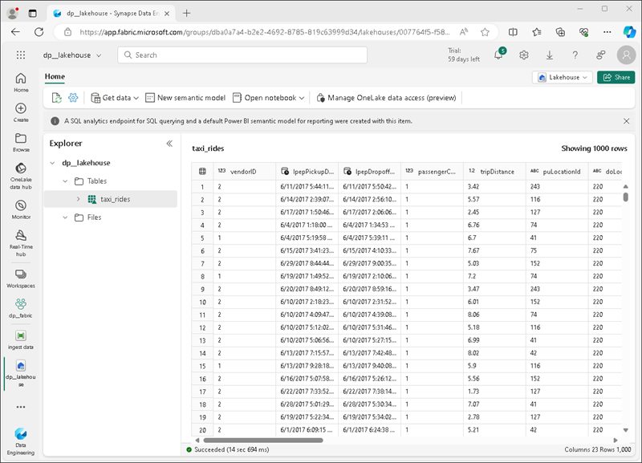

---
lab:
  title: Изучение аналитики данных в Microsoft Fabric
  module: Explore fundamentals of large-scale data analytics
---

# Изучение аналитики данных в Microsoft Fabric

В этом упражнении вы изучите прием данных и аналитику в Microsoft Fabric Lakehouse.

Выполнение этого задания займет около **25** минут.

> **Примечание.** Для выполнения этого упражнения потребуется лицензия Microsoft Fabric. Дополнительные сведения о том, как включить бесплатную пробную лицензию Fabric, см. в статье [Начало работы с Fabric](https://learn.microsoft.com/fabric/get-started/fabric-trial). Для этого вам понадобится *учебная* или *рабочая* учетная запись Microsoft. Если у вас ее нет, вы можете [зарегистрироваться для пробной версии Microsoft Office 365 E3 или более поздней версии](https://www.microsoft.com/microsoft-365/business/compare-more-office-365-for-business-plans).

*При первом использовании функций Microsoft Fabric могут появиться подсказки. Отклонить их.*

## Создание рабочей области

Прежде чем работать с данными в Fabric, создайте рабочую область с включенной пробной версией Fabric.

1. Войдите в [Microsoft Fabric](https://app.fabric.microsoft.com) по адресу `https://app.fabric.microsoft.com`.
1. В строке меню в нижнем левом углу переключитесь на **интерфейс Инжиниринг данных**.

    

1. В строке меню слева выберите **Рабочие области** (значок выглядит как ).
1. Создайте рабочую область с выбранным именем, выбрав режим лицензирования в разделе **Дополнительно**, который включает возможности Fabric (*пробная версия*, *premium* или *Fabric*).
1. Когда откроется новая рабочая область, она должна быть пустой.

    

## Создание озера данных

Теперь, когда у вас есть рабочая область, пришло время создать хранилище озера данных для файлов данных.

1. На домашней странице рабочей области создайте новый **Lakehouse** с выбранным именем.

    Через минуту или около того будет создано новое озеро данных:

    

1. Просмотрите новое озеро данных и обратите внимание, что **Панель обозревателя озера данных** слева позволяет просматривать таблицы и файлы в озере данных:
    - Папка **Таблицы** содержит таблицы, которые можно запрашивать с помощью SQL. Таблицы в озере Microsoft Fabric основаны на формате файла с открытым кодом *Delta Lake*, часто используемом в Apache Spark.
    - Папка **Файлы** содержит файлы данных в хранилище OneLake для озера данных, которые не связаны с управляемыми таблицами Delta. Вы также можете создать *ярлыки* в этой папке, чтобы ссылаться на данные, которые хранятся во внешней памяти.

    В настоящее время в озере данных нет таблиц или файлов.

## Прием данных

Простой способ приема данных — использовать действие **Копировать данные** в конвейере, чтобы извлечь данные из источника и скопировать их в файл в озере данных.

1. **На домашней** странице озера в **меню "Получение данных" выберите **"Создать конвейер** данных**" и создайте новый конвейер данных с именем **"Прием** данных".
1. В мастере **копирования данных** на **странице "Выбор источника** данных" выберите **пример данных**, а затем выберите набор данных NYC Taxi — Зеленый **** набор данных.

    

1. **На странице "Подключение к источнику** данных" просмотрите таблицы в источнике данных. Должна быть одна таблица, содержащая подробные сведения о поездках на такси в Нью-Йорке. Затем нажмите кнопку **Далее**, чтобы перейти на страницу **Выбор назначения данных**.
1. На странице **Выбор назначения данных** выберите существующее озеро данных. Затем выберите **Далее**.
1. Задайте следующие параметры назначения данных и нажмите кнопку **Далее**:
    - **Корневая папка**: Таблицы
    - **Загрузка параметров**: загрузка в новую таблицу
    - **Имя** целевой таблицы: taxi_rides *(возможно, потребуется дождаться предварительного просмотра сопоставлений столбцов, прежде чем изменить это)*
    - **Сопоставления столбцов**: *оставьте эту настройку по умолчанию как есть*
    - **Включить раздел**: *Не выбрано*
1. На странице**Просмотреть и сохранить** убедитесь, что выбран параметр **Немедленно начать передачу данных** и нажмите кнопку **Сохранить и запустить**.

    Создается новый конвейер, содержащий действие **Копировать данные**, как показано ниже:

    

    При запуске конвейера можно отслеживать его состояние на панели **Вывод** в разделе конструктора конвейеров. **Используйте значок &#8635;** (*обновить*) для обновления состояния и дождитесь успешного выполнения (что может занять 10 минут или больше).

1. В строке меню концентратора слева выберите озеро данных.
1. **На домашней** странице в **области обозревателя** Lakehouse в **меню "** Таблицы" в узле **"Таблицы" выберите "Обновить **", а затем разверните ****"Таблицы****", чтобы убедиться, что **таблица taxi_rides** создана.

    > **Примечание.** Если новая таблица указана как *неопознанная*, используйте его **меню "Обновить** ", чтобы обновить представление.

1. Выберите таблицу **taxi_rides** , чтобы просмотреть ее содержимое.

    

## Запрос данных в озере данных

Теперь, когда вы получили данные в таблицу в озере данных, вы можете использовать SQL для его запроса.

1. В правом верхнем углу страницы Lakehouse перейдите из **представления Lakehouse** в **конечную точку** аналитики SQL для озера.

1. На панели инструментов выберите **Новый SQL-запрос**. Введите в редактор запросов следующий код SQL:

    ```sql
    SELECT  DATENAME(dw,lpepPickupDatetime) AS Day,
            AVG(tripDistance) As AvgDistance
    FROM taxi_rides
    GROUP BY DATENAME(dw,lpepPickupDatetime)
    ```

1. **Выберите &#9655; Нажмите кнопку запуска**, чтобы запустить запрос и просмотреть результаты, которые должны включать среднее расстояние поездки для каждого дня недели.

    

## Визуализация данных в озере данных

Microsoft Fabric Lakehouse организует все таблицы в семантическую модель данных, которую можно использовать для создания визуализаций и отчетов.

1. В нижней левой части страницы **в области обозревателя** выберите **вкладку "Модель** ", чтобы просмотреть модель данных для таблиц в lakehouse (это включает системные таблицы, а также таблицу **taxi_rides** ).
1. На панели инструментов выберите **новый отчет** , чтобы создать отчет на **основе taxi_rides**.
1. В конструкторе отчетов:
    1. **В области данных** разверните таблицу **taxi_rides** и выберите **поля lpepPickupDatetime** и **passengerCount**.
    1. **В области "Визуализации" выберите визуализацию **графиков****. Затем убедитесь, что **ось X содержит **поле lpepPickupDatetime**, а **ось Y** содержит **сумму пассажира.****

        

    > **Совет**: Значки **>>** можно использовать для скрытия панелей конструктора отчетов, чтобы увидеть отчет более четко.

1. **В меню "Файл"** выберите **"Сохранить**", чтобы сохранить отчет в качестве **отчета о поездках** на такси в рабочей области Fabric.

    Отчет можно найти на странице рабочей области на портале Microsoft Fabric.

## Очистка ресурсов

По окончании изучения Microsoft Fabric можно удалить рабочую область, созданную для этого упражнения.

1. На панели слева выберите значок рабочей области, чтобы просмотреть все содержащиеся в ней элементы.
2. В меню **...** на панели инструментов выберите **Параметры рабочей области**.
3. В разделе **Другие** выберите **Удалить эту рабочую область**.
