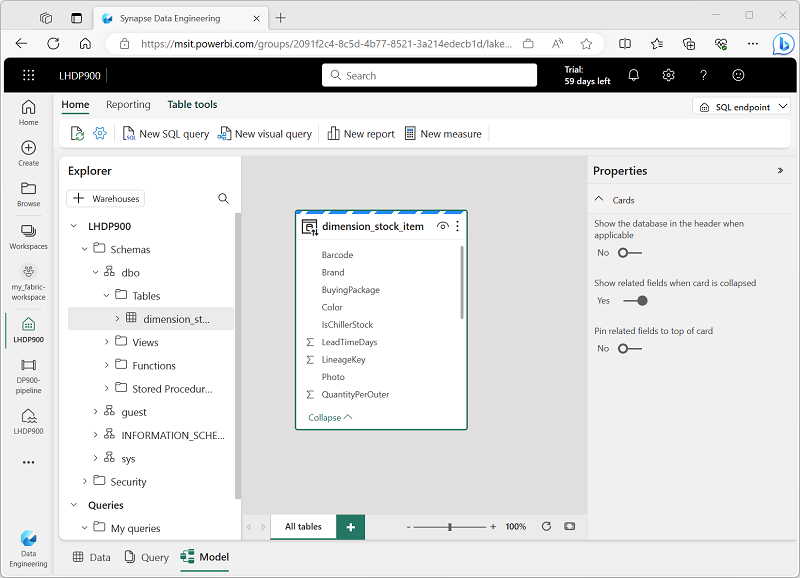

---
lab:
  title: Изучение аналитики данных в Microsoft Fabric
  module: Explore fundamentals of large-scale data analytics
---

# Изучение аналитики данных в Microsoft Fabric

В этом упражнении вы изучите прием данных и аналитику в Microsoft Fabric Lakehouse.

Выполнение этого задания займет около **25** минут.

> **Примечание.** Для выполнения этого упражнения потребуется лицензия Microsoft Fabric. Дополнительные сведения о том, как включить бесплатную пробную лицензию Fabric, см. в статье ["Начало работы с Fabric](https://learn.microsoft.com/fabric/get-started/fabric-trial) ". Для этого вам понадобится *учебная* или *рабочая* учетная запись Microsoft. Если у вас нет, вы можете [зарегистрироваться для пробной версии Microsoft Office 365 E3 или более поздней](https://www.microsoft.com/microsoft-365/business/compare-more-office-365-for-business-plans) версии.

## Создание рабочей области

Прежде чем работать с данными в Fabric, создайте рабочую область с включенной пробной версией Fabric.

1. Войдите в [Microsoft Fabric](https://app.fabric.microsoft.com) по адресу `https://app.fabric.microsoft.com`.
2. В строке меню слева выберите **рабочие области** (значок выглядит как ).
3. Создайте рабочую область с выбранным именем, выбрав режим лицензирования в **разделе "Дополнительно** ", который включает емкость Fabric (*пробная версия*, *premium* или *Fabric*).
4. Когда откроется новая рабочая область, она должна быть пустой.

    

## Создание склада

Теперь, когда у вас есть рабочая область, пришло время переключиться на *Интерфейс проектирования* данных на портале и создать хранилище данных для файлов данных.

1. В нижней левой части портала перейдите к интерфейсу **Инжиниринг данных**.

    

    Домашняя страница проектирования данных содержит плитки для создания часто используемых ресурсов проектирования данных.

2. На **домашней странице проектирования** данных создайте новый **Lakehouse** с выбранным именем.

    Через минуту или около того будет создан новый lakehouse:

    

3. Просмотрите новый lakehouse и обратите внимание, что **Панель обозревателя** Lakehouse слева позволяет просматривать таблицы и файлы в лейкхаусе:
    - Папка **"Таблицы"** содержит таблицы, которые можно запрашивать с помощью SQL. Таблицы в озере Microsoft Fabric основаны на формате файла *Delta Lake*открытый код, часто используемом в Apache Spark.
    - Папка **"Файлы"** содержит файлы данных в хранилище OneLake для lakehouse, которые не связаны с управляемыми разностными таблицами. Вы также можете создать *ярлыки* в этой папке, чтобы ссылаться на данные, хранящиеся внешне.

    В настоящее время в лейкхаусе нет таблиц или файлов.

## Прием данных

Простой способ приема данных — использовать **действие копирования данных** в конвейере, чтобы извлечь данные из источника и скопировать его в файл в lakehouse.

1. **На домашней** странице озера в **меню "Получение данных" выберите **"Создать конвейер** данных**" и создайте новый конвейер данных с именем **Ingest Sales Data**.
1. В мастере **копирования данных** на странице **Выбор источника данных** выберите **модель данных розничной торговли из примера набора данных Wide World Importers**.

    

1. Нажмите кнопку **"Далее**" и просмотрите таблицы в источнике данных на странице **Подключение источника данных**.
1. Выберите таблицу **dimension_stock_item** , содержащую записи продуктов. Затем нажмите кнопку **"Далее** ", чтобы перейти на **страницу "Выбор назначения** данных".
1. На странице **Выбор назначения** данных" выберите существующий lakehouse. Затем выберите **Далее**.
1. Задайте следующие параметры назначения данных и нажмите кнопку **Далее**:
    - **Корневая папка**: Таблицы
    - **Загрузка параметров**: загрузка в новую таблицу
    - **Название целевой таблицы**: dimension_stock_item
    - **Сопоставления столбцов**: *оставьте сопоставления по умолчанию как есть*
    - **Включение секции**: *отмена выбора*
1. На странице**проверки и сохранения** убедитесь, что **выбран параметр "Начать передачу данных"** и нажмите кнопку **"Сохранить и запустить**".

    Создается новый конвейер, **содержащий действие копирования данных** , как показано ниже.

    

    При запуске конвейера можно отслеживать его состояние в области вывода** в **конструкторе конвейеров. **Используйте значок &#8635;** (*Обновить*), чтобы обновить состояние и ждать, пока он не был успешно удален.

1. В строке меню концентратора слева выберите lakehouse.
1. **На домашней** странице в **области обозревателя** Lakehouse разверните **таблицы** и убедитесь, что **таблица dimension_stock_item** создана.

    > **Примечание**. Если новая таблица указана как *неопознанная*, нажмите **кнопку "Обновить** " на панели инструментов Lakehouse, чтобы обновить представление.

1. Выберите таблицу **dimension_stock_item** , чтобы просмотреть ее содержимое.

    

## Запрос данных в lakehouse

Теперь, когда вы получили данные в таблицу в lakehouse, вы можете использовать SQL для его запроса.

1. В правом верхнем углу страницы Lakehouse переключитесь на **конечную точку** SQL для lakehouse.

    

1. На панели инструментов выберите **Новый SQL-запрос**. Введите в панели редактора приведенный ниже SQL-запрос.

    ```sql
    SELECT Brand, COUNT(StockItemKey) AS Products
    FROM dimension_stock_item
    GROUP BY Brand
    ```

1. Выберите **▷ Нажмите кнопку "Выполнить**", чтобы запустить запрос и просмотреть результаты, которые должны показать, что в каждом из них есть два значения фирменной символики (*N/A* и *Northwind*).

    

## Визуализация данных в lakehouse

Microsoft Fabric Lakehouse упорядочивает все таблицы в модели данных, которую можно использовать для создания визуализаций и отчетов.

1. В нижней левой части страницы **в области Обозреватель** выберите **вкладку "Модель**", чтобы просмотреть модель данных для таблиц в lakehouse (в этом случае существует только одна таблица).

    

1. На панели инструментов выберите **новый отчет** , чтобы открыть новую вкладку браузера, содержащую конструктор отчетов Power BI.
1. В конструкторе отчетов:
    1. **В области данных** разверните таблицу **dimension_stock_item** и выберите **поля Brand** and **StockItemKey**.
    1. **На панели "Визуализации"** выберите **визуализацию гистограммы** с накоплением (это первая из них). Затем убедитесь, что ось Y содержит **поле фирменной символики** и измените агрегирование в **оси** X на **count**, чтобы оно содержало **поле Count of StockItemKey**.**** Наконец, измените размер визуализации на холсте отчета, чтобы заполнить доступное пространство.

        

    > **Совет** Значки **>>** можно использовать для скрытия панелей конструктора отчетов, чтобы увидеть отчет более четко.

1. **В меню "Файл"** выберите **"Сохранить**", чтобы сохранить отчет в качестве **отчета** о количестве бренда в рабочей области Fabric.

    Теперь вы можете закрыть вкладку браузера, константируя отчет, чтобы вернуться в lakehouse. Отчет можно найти на странице рабочей области на портале Microsoft Fabric.

## Очистка ресурсов

Если вы закончили изучение Microsoft Fabric, вы можете удалить рабочую область, созданную для этого упражнения.

1. На панели слева выберите значок рабочей области, чтобы просмотреть все элементы, содержащиеся в ней.
2. В меню **...** на панели инструментов выберите **параметры** рабочей области.
3. В разделе **Другие**" выберите **Удалить эту рабочую область**.
