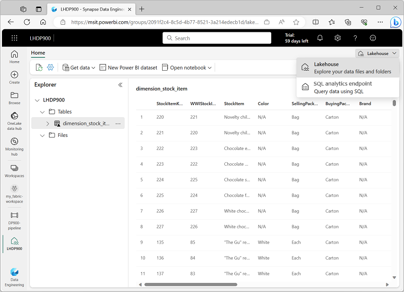

---
lab:
  title: Изучение аналитики данных в Microsoft Fabric
  module: Explore fundamentals of large-scale data analytics
---

# Изучение аналитики данных в Microsoft Fabric

В этом упражнении вы изучите прием и аналитику данных в Microsoft Fabric Lakehouse.

Выполнение этого задания займет около **25** минут.

> **Примечание**. Для выполнения этого упражнения вам потребуется лицензия Microsoft Fabric. Дополнительные сведения о том, как включить бесплатную пробную лицензию Fabric, см. в статье [Начало работы с Fabric](https://learn.microsoft.com/fabric/get-started/fabric-trial) . Для этого вам потребуется *учебная* или *рабочая* учетная запись Майкрософт. Если у вас ее нет, вы можете [зарегистрироваться для получения пробной версии Microsoft Office 365 E3 или более поздней версии](https://www.microsoft.com/microsoft-365/business/compare-more-office-365-for-business-plans).

## Создание рабочей области

Перед работой с данными в Fabric создайте рабочую область с включенной пробной версией Fabric.

1. Войдите в [Microsoft Fabric](https://app.fabric.microsoft.com) по адресу `https://app.fabric.microsoft.com`.
2. В строке меню слева выберите **Рабочие области** (значок похож на &#128455;).
3. Создайте рабочую область с именем по своему усмотрению, выбрав режим лицензирования в разделе **Дополнительно** , который включает емкость Fabric (*пробная версия*, *премиум* или *Структура*).
4. Когда откроется новая рабочая область, она должна быть пустой.

    

## Создание lakehouse

Теперь, когда у вас есть рабочая область, пришло время перейти к проектированию *данных* на портале и создать хранилище озера данных для файлов данных.

1. В левом нижнем углу портала перейдите к **интерфейсу Инжиниринг данных**.

    

    Домашняя страница инжиниринга данных содержит плитки для создания часто используемых ресурсов инжиниринга данных.

2. На домашней странице **Инжиниринг данных** создайте новый **lakehouse** с выбранным именем.

    Через минуту или около того будет создан новый lakehouse:

    

3. Просмотрите новый lakehouse и обратите внимание, что панель **обозревателя Lakehouse** слева позволяет просматривать таблицы и файлы в lakehouse:
    - Папка **Таблицы** содержит таблицы, которые можно запрашивать с помощью SQL. Таблицы в lakehouse Microsoft Fabric основаны на формате файлов открытый код *Delta Lake*, который обычно используется в Apache Spark.
    - Папка **Файлы** содержит файлы данных в хранилище OneLake для lakehouse, которые не связаны с управляемыми разностными таблицами. В этой папке также можно создать *ярлыки* для ссылки на данные, хранящиеся извне.

    В настоящее время в lakehouse нет таблиц или файлов.

## Прием данных

Простой способ приема данных — использовать действие **копирования данных** в конвейере, чтобы извлечь данные из источника и скопировать их в файл в lakehouse.

1. На **домашней** странице lakehouse в меню **Получить данные** выберите **Новый конвейер данных** и создайте новый конвейер данных с именем **Прием данных о продажах**.
1. В мастере **копирования данных** на странице **Выбор источника данных** выберите образец набора данных **Retail Data Model from Wide World Importers** .

    

1. Нажмите **кнопку Далее** и просмотрите таблицы в источнике данных на странице **Подключение к источнику данных** .
1. Выберите **таблицу dimension_stock_item** , содержащую записи о продуктах. Затем нажмите **кнопку Далее** , чтобы перейти на страницу **Выбор назначения данных** .
1. На странице **Выбор назначения данных** выберите существующий lakehouse. Выберите **Далее**.
1. Задайте следующие параметры назначения данных и нажмите кнопку **Далее**:
    - **Корневая папка**: Таблицы
    - **Параметры загрузки**: загрузка в новую таблицу
    - **Имя целевой таблицы**: dimProduct
    - **Сопоставления столбцов**: *оставьте сопоставления по умолчанию как есть*.
    - **Включить секцию**: *не выбрано*
1. На странице **Проверка _ сохранения** убедитесь, что выбран параметр **Начать передачу данных немедленно** , а затем выберите **Сохранить и запустить**.

    Создается новый конвейер, содержащий действие **копирования данных** , как показано ниже.

    

    После запуска конвейера его состояние можно отслеживать в области **Вывод** в конструкторе конвейера. Используйте значок **&#8635;** (*Обновить*), чтобы обновить состояние и подождите, пока оно не будет успешно установлено.

1. В строке меню концентратора слева выберите свой lakehouse.
1. На **домашней** странице в области **Обозреватель Lakehouse** разверните **узел Таблицы** и убедитесь, что таблица **dimProduct** создана.

    > **Примечание**. Если новая таблица указана как *неопознанная*, обновите представление с помощью кнопки **Обновить** на панели инструментов Lakehouse.

1. Выберите таблицу **dimProduct** , чтобы просмотреть ее содержимое.

    

## Запрос данных в lakehouse

Теперь, когда вы приняли данные в таблицу в lakehouse, вы можете использовать SQL для их запроса.

1. В правом верхнем углу страницы Lakehouse перейдите к **конечной точке SQL** для lakehouse.

    

1. На панели инструментов выберите **Создать SQL-запрос**. Затем введите следующий код SQL в редактор запросов:

    ```sql
    SELECT Brand, COUNT(StockItemKey) AS Products
    FROM dimProduct
    GROUP BY Brand
    ```

1. Нажмите ** кнопку&#9655; Выполнить** , чтобы выполнить запрос и просмотреть результаты, которые должны показать, что есть два значения торговой марки (*Н/Д* и *Северный ветер*) и количество продуктов в каждом из них.

    

## Визуализация данных в lakehouse

Microsoft Fabric lakehouse упорядочивает все таблицы в модели данных, которую можно использовать для создания визуализаций и отчетов.

1. В нижнем левом углу страницы в области **Обзор** выберите вкладку **Модель** , чтобы просмотреть модель данных для таблиц в lakehouse (в этом случае существует только одна таблица).

    

1. На панели инструментов выберите **Новый отчет** , чтобы открыть новую вкладку браузера, содержащую конструктор отчетов Power BI.
1. В конструкторе отчетов:
    1. В области **Данные** разверните таблицу **dimProduct** и выберите поля **Торговая марка** и **StockItemKey** .
    1. В области **Визуализации** выберите визуализацию **линейчатой диаграммы с накоплением** (она первая в списке). Затем убедитесь, что **ось Y** содержит поле **Торговая марка** , и измените агрегирование в **оси X** на **Count** , чтобы оно содержало поле **Count of StockItemKey** .
    
        

    > **Совет**. Значки **>>** можно использовать для скрытия областей конструктора отчетов, чтобы отчет был более четким.

1. В меню **Файл** выберите **Сохранить** , чтобы сохранить отчет в качестве **отчета о количестве торговых марок** в рабочей области Структура.

    Вы можете закрыть вкладку браузера с конта8 с отчетом, чтобы вернуться в lakehouse. Отчет можно найти на странице рабочей области на портале Microsoft Fabric.

## Очистка ресурсов

Если вы завершили изучение Microsoft Fabric, вы можете удалить рабочую область, созданную для этого упражнения.

1. На панели слева щелкните значок рабочей области, чтобы просмотреть все содержащиеся в ней элементы.
2. В меню **...** на панели инструментов выберите **Параметры рабочей области**.
3. В разделе **Другое** выберите **Удалить эту рабочую область**.
