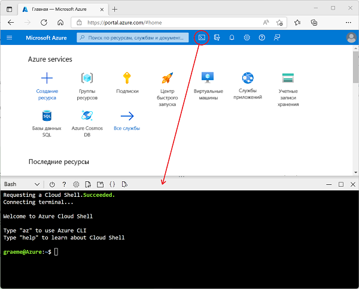

---
lab:
  title: Обзор Azure Stream Analytics
  module: Explore fundamentals of real-time analytics
---

# <a name="explore-azure-stream-analytics"></a>Обзор Azure Stream Analytics

В этом упражнении вы подготовите к работе задание Azure Stream Analytics в подписке Azure и используете его для обработки потока данных в реальном времени.

Выполнение этого задания займет около **15** минут.

## <a name="before-you-start"></a>Перед началом работы

Вам потребуется [подписка Azure](https://azure.microsoft.com/free) с доступом уровня администратора.

## <a name="create-azure-resources"></a>Создание ресурсов Azure

1. Войдите в свою подписку на [портале Azure](https://portal.azure.com), используя ее учетные данные.

1. Используйте кнопку **[\>_]** справа от панели поиска в верхней части страницы, чтобы создать новый Cloud Shell на портале Azure, создав хранилище при появлении запроса и выбрав среду ***Bash***. Cloud Shell предоставляет интерфейс командной строки в области в нижней части портала Azure, как показано ниже:

    

1. В Azure Cloud Shell введите указанную ниже команду, чтобы скачать необходимые для этого упражнения файлы.

    ```bash
    git clone https://github.com/MicrosoftLearning/DP-900T00A-Azure-Data-Fundamentals dp-900
    ```

1. Дождитесь завершения команды, а затем введите следующую команду, чтобы изменить текущий каталог на папку, содержащую файлы для этого упражнения.

    ```bash
    cd dp-900/streaming
    ```

1. Введите приведенную ниже команду, чтобы запустить сценарий, создающий ресурсы Azure, которые нужны для этого упражнения.

    ```bash
    bash setup.sh
    ```

    Подождите, пока сценарий запустится и выполнит следующие действия:

    1. Установит расширения Azure CLI, необходимые для создания ресурсов (*вы можете игнорировать любые предупреждения об экспериментальных расширениях*).
    1. Определит группу ресурсов Azure для этого упражнения.
    1. Создаст ресурс *Центра Интернета вещей Azure*, который будет использоваться для получения потока данных с имитированного устройства.
    1. Создаст *учетную запись хранения Azure*, в которой будут храниться обработанные данные.
    1. Создаст задание *Azure Stream Analytics*, которое будет обрабатывать входящие данные устройства в режиме реального времени и записывать результаты в учетную запись хранения.

## <a name="explore-the-azure-resources"></a>Обзор ресурсов Azure

1. На домашней странице [портала Azure](https://portal.azure.com?azure-portal=true) выберите **Группы ресурсов**, чтобы просмотреть группы ресурсов в своей подписке. Они должны включать группу **learn*xxxxxxxxxxxxxxxxx…** *, определяемую сценарием установки.
2. Выберите группу ресурсов **learn*xxxxxxxxxxxxxxxxx…** * и просмотрите содержащиеся в ней ресурсы, которые должны включать:
    - *Центр Интернета вещей* с именем **iothub*xxxxxxxxxxxxx***, который используется для получения входящих данных с устройств.
    - *Учетная запись хранения* с именем **store*xxxxxxxxxxxx***, в которую будут записываться результаты обработки данных.
    - *Задание Stream Analytics* с именем **stream*xxxxxxxxxxxx***, которое будет использоваться для обработки данных потоковой передачи.

    Если все три ресурса отсутствуют в списке, нажмите кнопку **&#8635; Обновить**, чтобы они появились.

    > **Примечание**. При использовании песочницы для обучения группа ресурсов может также содержать вторую *учетную запись хранения* с именем **cloudshell*xxxxxxxx***, где хранятся данные для службы Azure Cloud Shell, которую вы использовали для запуска сценария установки.

3. Выберите задание Stream Analytics **stream*xxxxxxxxxxxx*** и просмотрите информацию на странице **Обзор**, обратив внимание на следующие сведения:
    - Задание имеет один *ввод* с именем **iotinput** и один *вывод* с именем **bloboutput**. Они ссылаются на Центр Интернета вещей и учетную запись хранения, созданные сценарием установки.
    - В задании содержится *запрос*, который считывает данные из ввода **iotinput** и объединяет их, подсчитывая количество сообщений, обрабатываемых каждые 10 секунд. Кроме того, он выполняет запись результатов в вывод **blobooutput**.

## <a name="use-the-resources-to-analyze-streaming-data"></a>Использование ресурсов для анализа потоковых данных

1. В верхней части страницы **Обзор** задания Stream Analytics нажмите кнопку **&#9655; Запустить**, а затем на панели **Запуск задания** выберите **Запустить**, чтобы запустить задание.
2. Дождитесь уведомления об успешном запуске задания потоковой передачи.
3. Вернитесь в Azure Cloud Shell и введите указанную ниже команду, чтобы имитировать устройство, которое отправляет данные в Центр Интернета вещей.

    ```
    bash iotdevice.sh
    ```

4. Подождите, пока начнется имитация, о чем будет свидетельствовать следующий вывод:

    ```
    Device simulation in progress: 6%|#    | 7/120 [00:08<02:21, 1.26s/it]
    ```

5. Во время имитации вернитесь на страницу группы ресурсов **learn*xxxxxxxxxxxxxxxxx…** * на портале Azure и выберите учетную запись хранения **store*xxxxxxxxxxxx***.
6. На панели слева от колонки учетной записи хранения выберите вкладку **Контейнеры**.
7. Откройте контейнер **data**.
8. В контейнере **data** перейдите по иерархии папок, которая включает папку для текущего года с вложенными папками для месяца, дня и часа.
9. В папке часа обратите внимание на созданный файл с именем, аналогичным **0_xxxxxxxxxxxxxxxx.json**.
10. В меню **…** для файла (справа от сведений о файле), выберите **Просмотреть или изменить**, и просмотрите содержимое файла, который должен содержать запись JSON для каждого 10-секундного периода, отображающую количество сообщений, полученных от устройств IoT, например:

    ```
    {"starttime":"2021-10-23T01:02:13.2221657Z","endtime":"2021-10-23T01:02:23.2221657Z","device":"iotdevice","messages":2}
    {"starttime":"2021-10-23T01:02:14.5366678Z","endtime":"2021-10-23T01:02:24.5366678Z","device":"iotdevice","messages":3}
    {"starttime":"2021-10-23T01:02:15.7413754Z","endtime":"2021-10-23T01:02:25.7413754Z","device":"iotdevice","messages":4}
    ...
    ```

11. Нажмите кнопку **&#8635; Обновить**, чтобы обновить файл, учитывая, что дополнительные результаты записываются в файл, поскольку задание Stream Analytics обрабатывает данные устройства в режиме реального времени по мере их потоковой передачи с устройства в Центр Интернета вещей.
12. Вернитесь в Azure Cloud Shell и дождитесь завершения имитации устройства (она должно длиться около 3 минут).
13. Вернувшись на портал Azure, еще раз обновите файл, чтобы просмотреть полный набор результатов, полученных во время имитации.
14. Вернитесь в группу ресурсов **learn*xxxxxxxxxxxxxxxxx…** * и вновь откройте задание Stream Analytics **stream*xxxxxxxxxxxxx***.
15. В верхней части страницы задания Stream Analytics нажмите кнопку **&#11036; Остановить**, чтобы остановить задание, подтвердив действие при появлении запроса.

> **Совет**. Когда вы завершите знакомство с решением потоковой передачи, созданную в этом упражнении группу ресурсов можно удалить.
