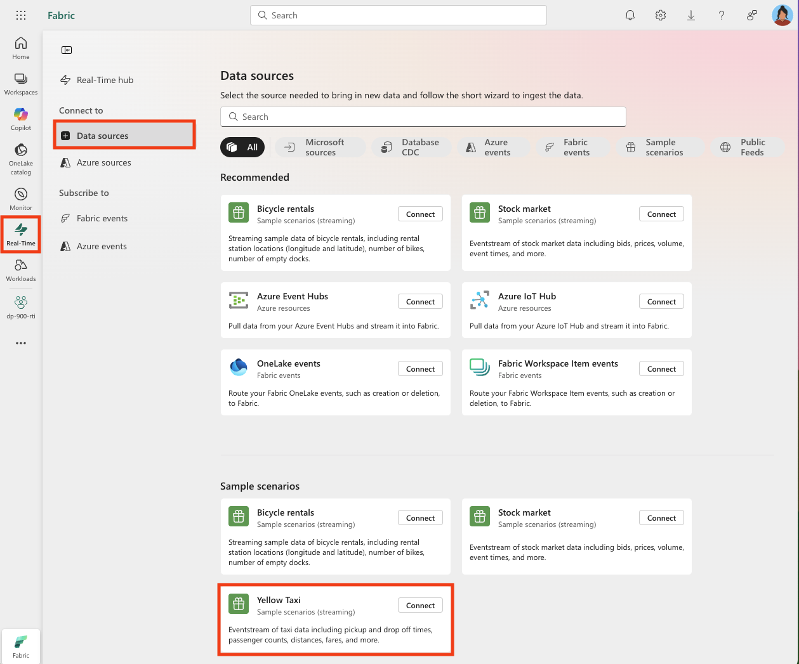

---
lab:
  title: Изучение аналитики в режиме реального времени в Microsoft Fabric
  module: Explore real-time analytics in Microsoft Fabric
---

# Изучение аналитики в режиме реального времени в Microsoft Fabric

Microsoft Fabric предоставляет аналитику в режиме реального времени, позволяя создавать аналитические решения для потоков данных в режиме реального времени. В этом упражнении вы будете использовать возможности аналитики в режиме реального времени в Microsoft Fabric для приема, анализа и визуализации потока данных в реальном времени от компании такси.

Эта лаборатория занимает около **30** минут.

> **Примечание.** Для выполнения этого упражнения требуется [клиент](https://learn.microsoft.com/fabric/get-started/fabric-trial) Microsoft Fabric.

## Создание рабочей области

Прежде чем работать с данными в Fabric, необходимо создать рабочую область с включенной емкостью Fabric.

1. Перейдите на [домашнюю страницу `https://app.fabric.microsoft.com/home?experience=fabric`](https://app.fabric.microsoft.com/home?experience=fabric) Microsoft Fabric в браузере и войдите с помощью учетных данных Fabric.
1. В строке меню слева выберите **Рабочие области** (значок выглядит как ).
1. Создайте рабочую область с выбранным именем, выбрав режим лицензирования, включающий емкость Fabric (*пробная версия*, *premium* или *Fabric*).
1. Когда откроется новая рабочая область, она должна быть пустой.

    

## Создание потока событий

Теперь вы готовы найти и принять данные в режиме реального времени из источника потоковой передачи. Для этого вы начнете работу в Центре реального времени Fabric.

> **Совет.** При первом использовании Центра реального времени могут отображаться некоторые *советы по началу работы* . Вы можете закрыть их.

1. В строке меню слева выберите **концентратор реального времени** .

    Концентратор в режиме реального времени предоставляет простой способ поиска источников потоковых данных и управления ими.

    

1. В центре реального времени в **разделе "Подключение к** " выберите **источники** данных.
1. Найдите источник данных "Желтый такси **" **и выберите **"Подключить".** Затем в мастере подключения** присвойте **источнику имя и `taxi` измените имя потока событий по умолчанию, чтобы изменить его `taxi-data`на . Поток по умолчанию, связанный с данными, автоматически будет называться *taxi-data-stream*:

    

1. Нажмите кнопку **"Далее** " и дождитесь создания исходного и события, а затем нажмите кнопку **"Открыть поток** событий". В потоке событий будет отображаться **источник такси** и **поток** данных такси на холсте конструктора:

   

## Создание дома событий

Поток событий получает данные акций в режиме реального времени, но в настоящее время не делает ничего с ним. Создадим хранилище событий, в котором можно хранить захваченные данные в таблице.

1. В строке меню слева нажмите кнопку **"Создать**". ** На новой странице в разделе Inteligence* в режиме *реального времени выберите **Eventhouse**. Присвойте ему уникальное имя вашего выбора.

    >**Примечание**. Если **параметр "Создать** " не закреплен на боковой панели, сначала необходимо выбрать параметр с многоточием (**...**).

    Закройте все советы или запросы, отображаемые до тех пор, пока не увидите новое пустое хранилище событий.

    

1. В области слева обратите внимание, что в вашем хранилище событий содержится база данных KQL с таким же именем, как и в хранилище событий. Вы можете создавать таблицы для данных в режиме реального времени в этой базе данных или создавать дополнительные базы данных по мере необходимости.
1. Выберите базу данных и обратите внимание, что существует связанный *набор* запросов. Этот файл содержит некоторые примеры запросов KQL, которые можно использовать для начала запроса таблиц в базе данных.

    Однако в настоящее время нет таблиц для запроса. Давайте разрешим эту проблему, получив данные из потока событий в новую таблицу.

1. На главной странице базы данных KQL выберите " **Получить данные**".
1. Для источника данных выберите **eventstream**** > Existing eventstream.**
1. **В области выбора или создания целевой таблицы** создайте новую таблицу с именем`taxi`. Затем в **области "Настройка источника** данных" выберите рабочую область и **поток событий данных такси** и назовите подключение `taxi-table`.

   

1. **Нажмите кнопку "Далее**", чтобы выполнить действия, чтобы проверить данные, а затем завершить настройку. Затем закройте окно конфигурации, чтобы просмотреть хранилище событий с таблицей акций.

   

    Соединение между потоком и таблицей было создано. Давайте убедимся, что в потоке событий.

1. В строке меню слева выберите **концентратор реального времени** и просмотрите страницу **"Мои потоки** данных". **В меню ...** для потока потоковой передачи **** данных такси выберите **"Открыть поток** событий".

    Теперь в потоке событий отображается назначение для потока:

   

    > **Совет.** Выберите место назначения на холсте конструктора и если под ним не отображается предварительный просмотр данных, нажмите кнопку **"Обновить**".

    В этом упражнении вы создали очень простой поток событий, который записывает данные в режиме реального времени и загружает его в таблицу. В реальном решении обычно добавляются преобразования для агрегирования данных по темпоральным окнам (например, для отслеживания средней цены каждой акции в течение пяти минут).

    Теперь давайте рассмотрим, как можно запрашивать и анализировать захваченные данные.

## Запрос захваченных данных

Поток событий записывает данные тарифа на такси в режиме реального времени и загружает его в таблицу в базе данных KQL. Эту таблицу можно запросить, чтобы просмотреть захваченные данные.

1. В строке меню слева выберите базу данных eventhouse.
1. *Выберите набор* запросов для базы данных.
1. В области запросов измените первый пример запроса, как показано здесь:

    ```kql
    taxi
    | take 100
    ```

1. Выберите код запроса и запустите его, чтобы просмотреть 100 строк данных из таблицы.

    

1. Просмотрите результаты, а затем измените запрос, чтобы отобразить количество сборов такси в течение каждого часа:

    ```kql
    taxi
    | summarize PickupCount = count() by bin(todatetime(tpep_pickup_datetime), 1h)
    ```

1. Выделите измененный запрос и запустите его, чтобы просмотреть результаты.
1. Подождите несколько секунд и снова запустите его, отметив, что количество операций сбора изменений при добавлении новых данных в таблицу из потока в режиме реального времени.

## Очистка ресурсов

В этом упражнении вы создали хранилище событий, прием данных в режиме реального времени с помощью потока событий, запросили прием данных в таблице базы данных KQL, создали панель мониторинга в режиме реального времени для визуализации данных в режиме реального времени и настроили оповещение с помощью активатора.

Если вы закончили изучение аналитики в режиме реального времени в Fabric, вы можете удалить рабочую область, созданную для этого упражнения.

1. На панели слева выберите значок рабочей области.
2. На панели инструментов выберите **параметры** рабочей области.
3. **В разделе "Общие**" выберите **"Удалить эту рабочую область**".
