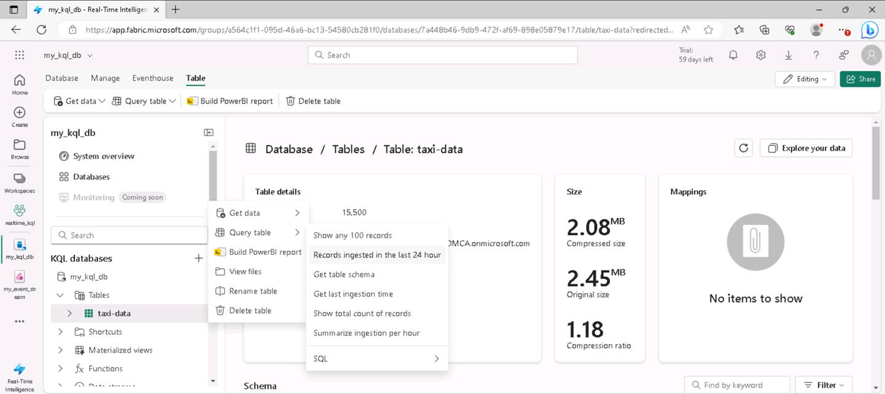

---
lab:
  title: Изучение аналитики в режиме реального времени в Microsoft Fabric
  module: Explore fundamentals of large-scale data analytics
---

# Изучение аналитики в режиме реального времени в Microsoft Fabric

В этом упражнении вы изучите аналитику в режиме реального времени в Microsoft Fabric.

Выполнение этого задания займет около **25** минут.

> **Примечание.** Для выполнения этого упражнения потребуется лицензия Microsoft Fabric. Дополнительные сведения о том, как включить бесплатную пробную лицензию Fabric, см. в статье ["Начало работы с Fabric](https://learn.microsoft.com/fabric/get-started/fabric-trial) ". Для этого вам понадобится *учебная* или *рабочая* учетная запись Microsoft. Если у вас нет, вы можете [зарегистрироваться для пробной версии Microsoft Office 365 E3 или более поздней](https://www.microsoft.com/microsoft-365/business/compare-more-office-365-for-business-plans) версии.

## Создание рабочей области

Прежде чем работать с данными в Fabric, создайте рабочую область с включенной пробной версией Fabric.

1. Войдите в [Microsoft Fabric](https://app.fabric.microsoft.com) по адресу `https://app.fabric.microsoft.com`.
2. В строке меню слева выберите **рабочие области** (значок выглядит как ).
3. Создайте рабочую область с выбранным именем, выбрав режим лицензирования в **разделе "Дополнительно** ", который включает емкость Fabric (*пробная версия*, *premium* или *Fabric*).
4. Когда откроется новая рабочая область, она должна быть пустой.

    

## Создание базы данных KQL

Теперь, когда у вас есть рабочая область, можно создать базу данных KQL для хранения данных в режиме реального времени.

1. В нижней левой части портала перейдите к интерфейсу **Аналитика в режиме реального времени**.

    

    Домашняя страница аналитики в режиме реального времени включает плитки для создания часто используемых ресурсов для данных в режиме реального времени

2. На домашней странице аналитики в режиме реального времени создайте новую **базу данных** KQL с выбранным именем.

    Через минуту будет создана новая база данных KQL:

    

    В настоящее время в базе данных нет таблиц.

## Создание потока событий

Потоки событий предоставляют масштабируемый и гибкий способ приема данных в режиме реального времени из источника потоковой передачи.

1. В строке меню слева выберите **домашнюю** страницу для аналитики в режиме реального времени.
1. На домашней странице выберите плитку, чтобы создать новый **поток** событий с выбранным именем.

    Через некоторое время отображается визуальный конструктор для потока событий.

    

    На холсте визуального конструктора показан источник, который подключается к потоку событий, который, в свою очередь, подключен к назначению.

1. На холсте конструктора в списке **Новый источник** выберите **пример данных**. Затем в области **Пример данных** укажите имя **такси** и выберите пример данных **Желтый такси**" (который представляет данные, собранные из поездки на такси). Нажмите кнопку **Добавить**.
1. Под холстом конструктора выберите вкладку **Предварительный просмотр** данных", чтобы просмотреть данные, передаваемые из источника:

    

1. На холсте конструктора в списке **новых назначений** выберите **базу данных** KQL. Затем в **области базы данных  KQL**\укажите имя **такси назначения** и выберите рабочую область и базу данных KQL. Затем нажмите кнопку **Создать и Настроить**".
1. В мастере **приема данных** на **странице назначения** выберите **"Создать таблицу** " и введите имя **таблицы taxi-data**. Затем щелкните **Следующий  Ресурс**.
1. На странице **Источник**  просмотрите  имя подключения к данным по умолчанию и нажмите кнопку **Следующая: схема**.
1. На странице **Схемы** измените **Формат** данных с TXT на **JSON** и просмотрите предварительный просмотр, чтобы убедиться, что этот формат приводит к нескольким столбцам данных. Затем выберите **Далее: сводка**.
1. На странице **Сводка**" подождите, пока будет установлено непрерывное прием, а затем нажмите кнопку **Закрыть**.
1. Убедитесь, что завершенный поток событий выглядит следующим образом:

    

## Запрос данных в реальном времени в базе данных KQL

Поток событий постоянно заполняет таблицу в базе данных KQL, что позволяет запрашивать данные в режиме реального времени.

1. В центре меню слева выберите базу данных KQL (или выберите рабочую область и найдите там базу данных KQL).
1. В меню **...** для **таблицы данных** такси (которая была создана в потоке событий), выберите **таблицу запросов > записи, принятые за последние 24 часа**.

    

1. Просмотрите результаты запроса, который должен быть запросом KQL следующим образом:

    ```kql
    ['taxi-data']
    | where ingestion_time() between (now(-1d) .. now())
    ```

    Результаты показывают все записи такси, полученные из источника потоковой передачи за последние 24 часа.

1. Замените весь код запроса KQL в верхней половине редактора запросов следующим кодом:

    ```kql
    // This query returns the number of taxi pickups per hour
    ['taxi-data']
    | summarize PickupCount = count() by bin(tpep_pickup_datetime, 1h)
    ```

1. Используйте** ▷ Нажмите кнопку запуска**, чтобы запустить запрос и просмотреть результаты, которые показывают количество сборов такси за каждый час.

## Очистка ресурсов

Если вы закончили изучение аналитики в режиме реального времени в Microsoft Fabric, вы можете удалить рабочую область, созданную для этого упражнения.

1. На панели слева выберите значок рабочей области, чтобы просмотреть все элементы, содержащиеся в ней.
2. В меню **...** на панели инструментов выберите **параметры** рабочей области.
3. В разделе **Другие**" выберите **Удалить эту рабочую область**.
