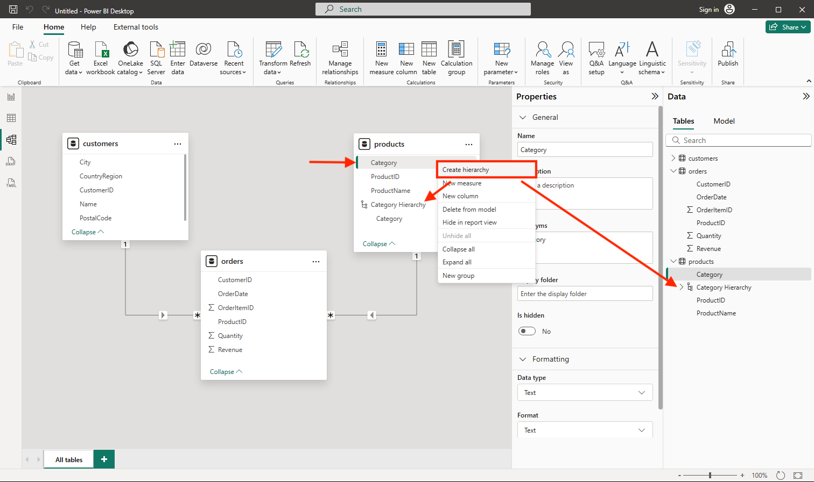

---
lab:
  title: "Изучение основ визуализации данных с помощью Power\_BI"
  module: Explore fundamentals of data visualization
---

# Изучение основ визуализации данных с помощью Power BI

В этом упражнении вы будете использовать Microsoft Power BI Desktop для создания модели данных и отчета, содержащего интерактивные визуализации данных.

Выполнение этого задания займет около **20** минут.

## Перед началом работы

Вам потребуется [подписка Azure](https://azure.microsoft.com/free) с доступом уровня администратора.

### Установите Power BI Desktop

Если Microsoft Power BI Desktop еще не установлен на компьютере на основе Windows, его можно скачать и установить бесплатно.

1. Скачайте установщик Power BI Desktop отсюда: [https://aka.ms/power-bi-desktop](https://aka.ms/power-bi-desktop?azure-portal=true).
1. После загрузки файла откройте его и используйте мастер установки, чтобы установить Power BI Desktop на компьютере. Установка может занять несколько минут.

## Импорт данных

1. Запустите Power BI Desktop. Интерфейс приложения должен выглядеть следующим образом:

    

    Теперь все готово для импорта данных для отчета.

1. На экране приветствия Power BI Desktop выберите **Получить данные**, а затем в списке источников данных выберите **Веб**, а затем — **Подключить**.

    

1. В диалоговом окне **Из Интернета** введите следующий URL-адрес и нажмите кнопку **OK**.

    ```
    https://github.com/MicrosoftLearning/DP-900T00A-Azure-Data-Fundamentals/raw/master/power-bi/customers.csv
    ```

1. В диалоговом окне "Доступ к веб-содержимому" выберите **Подключить**.

1. Убедитесь, что по URL-адресу открывается набор данных, содержащий данные клиента, как показано ниже. Затем нажмите кнопку **Загрузить**, чтобы загрузить данные в модель данных для отчета.

    

1. В главном окне Power BI Desktop в меню "Данные" выберите **Получение данных**, а затем — **Интернет**:

    

1. В диалоговом окне **Из Интернета** введите следующий URL-адрес и нажмите кнопку **OK**.

    ```
    https://github.com/MicrosoftLearning/DP-900T00A-Azure-Data-Fundamentals/raw/master/power-bi/products.csv
    ```

1. В диалоговом окне выберите **Загрузить**, чтобы загрузить данные о продуктах из этого файла в модель данных.

1. Повторите предыдущие три шага, чтобы импортировать третий набор данных, содержащий данные о заказах, по следующему URL-адресу:

    ```
    https://github.com/MicrosoftLearning/DP-900T00A-Azure-Data-Fundamentals/raw/master/power-bi/orders.csv
    ```

## Изучение модели данных

В модель данных загружены три таблицы импортированных данных, которые теперь можно исследовать и уточнять.

1. С правого края Power BI Desktop выберите вкладку **Модель**, а затем расположите таблицы в модели так, чтобы видеть их. Вы можете скрывать панели справа с помощью значков **>>**:

    

1. В таблице **заказы** выберите поле **Доход**, а затем на панели **Свойства** задайте для свойства **Формат** значение **Валюта**.

    

    Это обеспечит отображение значений дохода как валюты в визуализациях отчета.

1. В таблице products щелкните правой кнопкой мыши поле **Category** (или откройте его меню **&vellip;**) и выберите **Создать иерархию**. Это действие создаст иерархию с именем **Category Hierarchy** (Иерархия категорий). Чтобы увидеть ее, может потребоваться развернуть или прокрутить вниз таблицу **products**. Она также отображается в панели **Поля**:

    

1. В таблице products щелкните правой кнопкой мыши поле **ProductName** (или откройте его меню **&vellip;**) и выберите **Добавить в иерархию** > **Category Hierarchy**. В результате в созданную ранее иерархию будет добавлено поле **ProductName**.
1. В области **Поля** щелкните правой кнопкой мыши элемент **Иерархия категорий** (или откройте его меню **...**) и выберите команду **Переименовать**. Переименуйте иерархию в **Categorized Product** (Классифицируемый продукт).

    

1. У левого края выберите вкладку **Представление данных**, а затем в области **Данные** выберите таблицу **customers**.
1. Выберите заголовок столбца **City**, а затем задайте для его свойства **Категория данных** значение **City**:

    

    Это обеспечит интерпретацию значений в этом столбце как названий городов, что может быть полезно, если предполагается добавление визуализаций карт.

## Создание отчета

Теперь все почти готово для создания отчета. Сначала необходимо проверить ряд параметров и убедиться, что включены все визуализации.

1. В меню **Файл** выберите **Параметры и настройки**. Затем выберите **Параметры**, в разделе **Безопасность** убедитесь, что включен параметр **Использование визуальных элементов карты и картограммы** и нажмите кнопку **ОК**.

    

    Этот параметр обеспечит возможность включения визуализаций карт в отчеты.

1. У левого края выберите вкладку **Представление отчетов** и просмотрите интерфейс конструктора отчетов.

    

1. На ленте над областью конструктора отчета выберите **Текстовое поле** и добавьте в отчет текстовое поле, содержащее текст **Sales Report**. Отформатируйте текст, применив полужирный шрифт размером 32.

    

1. Выберите любую пустую область в отчете, чтобы отменить выбор текстового поля. Затем в области **Данные** разверните узел **Продукты** и выберите поле **Классифицируемые продукты**. Это добавит в отчет таблицу.

    

1. Выбрав таблицу, в области **Данные** разверните узел **Заказы** и выберите **Доход**. В таблицу будет добавлен столбец Revenue. Может потребоваться увеличить размер таблицы, чтобы увидеть его.

    К доходу применяется формат валюты, как указано в модели. Однако число десятичных разрядов не указано, поэтому среди значений есть дробные величины. Это не имеет значения для создаваемых визуализаций, но при желании вы можете вернуться на вкладку **Модель** или **Данные** и изменить число десятичных знаков.

    

1. Выбрав таблицу, в области **Визуализации**, выберите визуализацию **Гистограмма с накоплением**. Таблица изменяется на гистограмму, на которой показан доход по категориям.

    

1. Над выбранной гистограммой нажмите на значок **&#8595;**, чтобы включить детализацию. Затем на диаграмме выберите второй столбец, чтобы детализировать данные и просмотреть доход для отдельных продуктов в этой категории. Это возможно, поскольку определена иерархия категорий и продуктов.

    

1. Используйте значок **&#x2191;** для уменьшения детализации до уровня категории. Затем нажмите на значок **(**&#8595;**)**, чтобы отключить функцию детализации.
1. Выберите пустую область отчета, а затем в области **Данные** выберите поле **Количество** в таблице **заказы** и поле **Категория** в таблице **продукты**. Это выведет другую гистограмму, показывающую объем продаж по категориям продуктов.
1. Выбрав новую гистограмму, в области **Визуализации** выберите **Круговая диаграмма**, а затем измените размер диаграммы и поместите ее рядом с диаграммой дохода по категориям.

    

1. Выберите пустую область отчета, а затем в области **Данные** выберите поле **Город** в таблице **заказчики** и поле **Доход** в таблице **заказы**. Будет выведена карта с доходом от продаж по городам. Расположите визуализации и измените их размер необходимым образом:

    

1. Обратите внимание, что для взаимодействия на карте можно перетаскивать элементы, дважды щелкать, использовать колесо мыши или сжатие и перетаскивание на сенсорном экране. Затем выберите конкретный город и обратите внимание, что другие визуализации в отчете изменятся, и на них будут выделены данные для выбранного города.

    

1. В меню **File** (Файл) выберите пункт **Save** (Сохранить). Теперь сохраните файл с соответствующим именем файл PBIX. Вы можете открыть файл и дополнительно изучить моделирование данных и визуализацию.

Если у вас есть подписка на [службу Power BI](https://www.powerbi.com/?azure-portal=true), вы можете войти в свою учетную запись и опубликовать отчет в рабочей области Power BI. 
